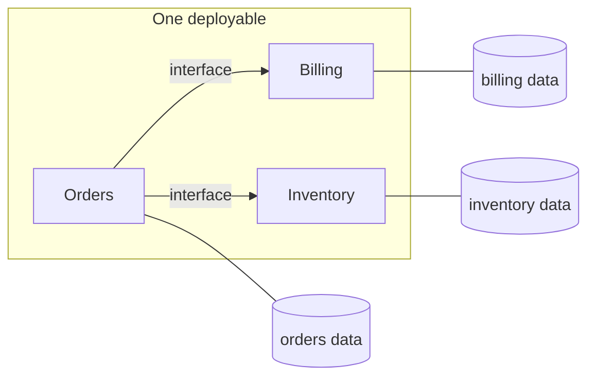
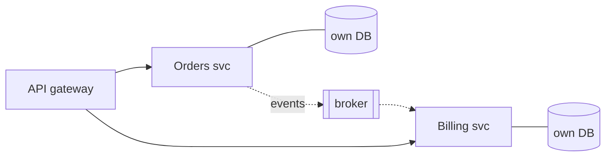
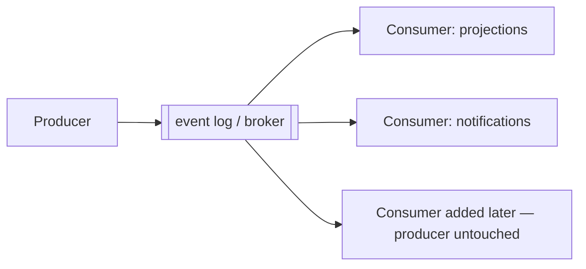
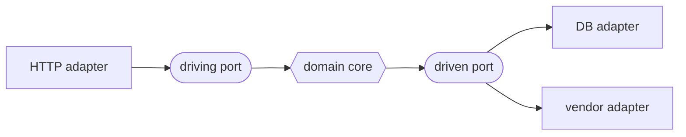
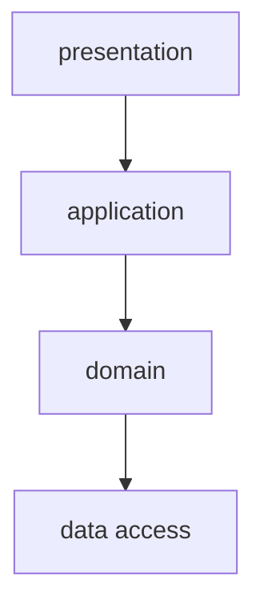
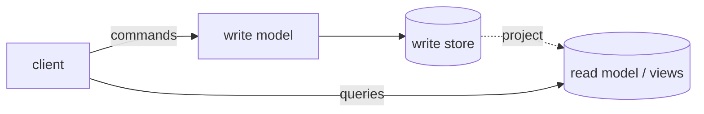
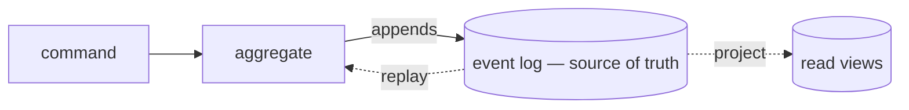
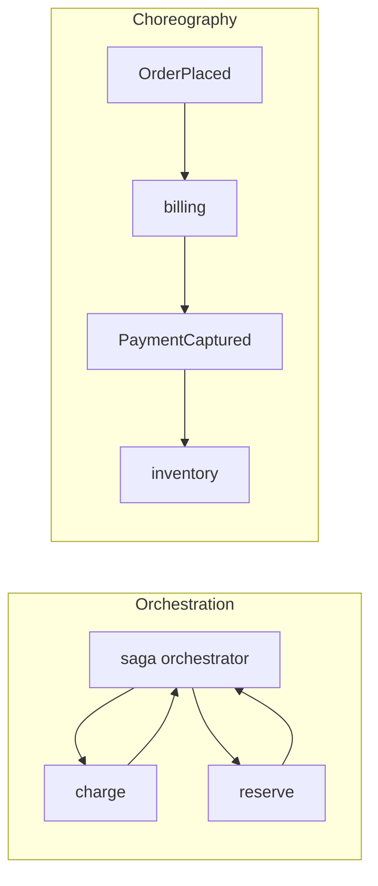
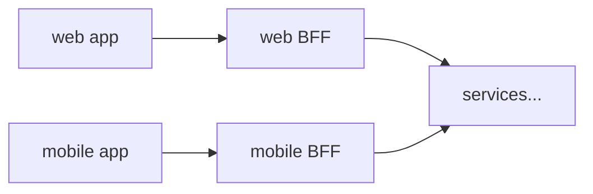
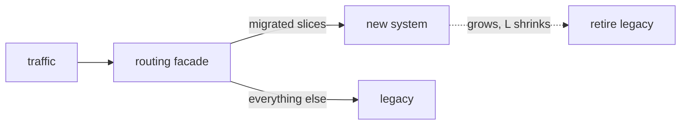

# Architecture Patterns

Style selection for the coarse shape of a system. The engine here is a single bias: **start with one deployable, split only when a named requirement forces it.** Every pattern below is scored against that default. When two shapes are close, pick the one that is cheaper to undo — a monolith becomes services far more easily than services recombine into a monolith.

Read this when you are on step 2 of the workflow (architecture style), or when the user asks "monolith or microservices?", "should we use events?", or "how do we document this decision?".

## The default: monolith-first

**Begin with a modular monolith** — one deployable process, hard module boundaries *inside* it (separate packages/namespaces, no shared mutable state across seams, dependencies pointing one way). This is the highest-leverage default because it gives you most of the benefit people chase in microservices — clear ownership, testable boundaries, an extraction path — while paying none of the distributed-systems tax: no network between your own functions, one transaction, one deploy, one place to look when it breaks.

The mistake this section exists to prevent is **premature distribution**: reaching for services, queues, and eventual consistency before the requirements that justify them exist. Distribution is not an architecture upgrade. It is a set of costs (network partitions, partial failure, distributed transactions, versioned contracts, N deploy pipelines, cross-service debugging) you take on to buy specific benefits. If you can't name the benefit in the requirements, you are only buying the cost.

**Design the module seams well from day one.** The seams are where you will cut later if you must. A monolith with clean internal boundaries extracts cleanly; a big ball of mud does not, and its owners conclude — wrongly — that "the monolith failed" when what failed was the boundaries. Modularity is the load-bearing decision; the single deployable is just the cheap default that rides on it.

## The patterns

Each pattern below lists **when to use**, **trade-offs**, and **failure modes**. They are not mutually exclusive: layered and hexagonal describe *internal* structure and apply inside a monolith or a single service; monolith / modular monolith / microservices describe *deployment* shape; event-driven describes *how components communicate*. A real system picks one deployment shape, one internal structure, and one dominant communication style.

### Monolith (single-module)

One deployable, and internally undifferentiated — code organized by convenience, not by hard boundaries.

- **When to use**: prototypes, spikes, genuinely small and stable domains, solo/tiny teams shipping to find product-market fit. Speed of change dominates and there is no boundary worth enforcing yet.
- **Trade-offs**: fastest to build and deploy; zero distribution cost. But without internal boundaries it rots — every change touches everything, and you lose the clean extraction path.
- **Failure modes**: the **big ball of mud** — no seams, so nothing can be reasoned about, tested, or later extracted in isolation. This is the version of "monolith" that gives the word a bad name.

Prefer the modular variant below for anything you expect to live more than a few months.

### Modular monolith (the default)

One deployable, hard module boundaries inside: modules communicate through explicit in-process interfaces, own their data, and depend in one direction.

- **When to use**: **almost always, first.** Any system where you don't yet have a *named, requirements-backed* reason to distribute. It scales to surprisingly large teams and codebases (see exemplars).
- **Trade-offs**: keeps deploy and transaction simplicity of a monolith while buying most of the modularity benefit of services. Cost: the whole app still deploys and scales as one unit, and one module's memory leak or hot loop can starve the others.
- **Failure modes**: boundary erosion — a "temporary" cross-module shortcut (a shared table, a direct call past the interface) that quietly welds two modules together. Guard the seams with enforced dependency rules, not good intentions.

### Microservices

Many independently deployable services, each owning its data, communicating over the network (sync RPC and/or async events).

- **When to use**: only when one or more **extraction triggers** below is real. The unit of a microservice is a team's bounded context, not a noun.
- **Trade-offs**: independent deploy, independent scaling, fault isolation, and polyglot freedom — bought with network latency, partial failure, distributed transactions (or the sagas that replace them), contract versioning, per-service infra, and dramatically harder end-to-end debugging and testing.
- **Failure modes**: the **distributed monolith** — services that must deploy together, share a database, or call each other synchronously in deep chains. You pay every distribution cost and get none of the independence. Also: chatty sync call graphs (one user request fans into 30 internal hops), and eventual consistency bolted onto a domain that needed a transaction.

### Event-driven

Components communicate by producing and consuming events over a broker (or an internal event bus) rather than calling each other directly. Includes pub/sub, event streaming, and event sourcing.

- **When to use**: high write/ingest fan-out, decoupling producers from an unknown set of consumers, workloads that are naturally asynchronous (notifications, analytics pipelines, audit trails), and cases where you need a durable, replayable log of what happened (event sourcing for ledgers/audit).
- **Trade-offs**: strong temporal decoupling and independent scaling of producers and consumers; new consumers attach without touching producers. Cost: eventual consistency becomes the default, ordering and exactly-once delivery are hard, and the flow of causality is no longer visible in a stack trace.
- **Failure modes**: hidden coupling through event *schemas* (a producer can't evolve an event without breaking silent consumers); unbounded retry/replay and poison messages with no dead-letter path; using events for a request that needed a synchronous answer (the caller now polls, reinventing RPC badly); event sourcing on a domain that never needed the audit log, paying its complexity for nothing.

**Smell test** — if a consumer immediately needs the result back to continue the user's request, you wanted a request/response call, not an event. Reserve events for fire-and-forget and fan-out. See "Event-driven vs. request-response" below.

### Hexagonal (ports and adapters)

Domain logic at the center, depending on nothing external. All I/O (DB, HTTP, queues, third-party APIs) sits behind **ports** (interfaces the domain defines) implemented by **adapters** at the edge. Dependencies point inward.

- **When to use**: domains with real business logic worth protecting from framework and infrastructure churn; systems that must swap infrastructure (DB, message broker, external vendor) or test the core without spinning up I/O. Pairs naturally with domain-driven design.
- **Trade-offs**: the core is trivially unit-testable and infrastructure is replaceable; framework upgrades and vendor swaps stay at the edge. Cost: more indirection and interfaces — overkill for a CRUD app that is mostly moving rows in and out of a database.
- **Failure modes**: over-abstraction — ports and adapters wrapping logic that is *only* CRUD, so every field change touches four layers for no benefit. And **leaky ports**: a port whose interface exposes the DB's types or the vendor's quirks, so the "swap" the pattern promised is a fiction.

### Layered (n-tier)

Horizontal layers — presentation → application/service → domain → data-access — each depending only on the one below.

- **When to use**: the familiar default *inside* a service or monolith; well understood, easy to onboard into, adequate for straightforward line-of-business apps.
- **Trade-offs**: simple and universally understood; clear where a given kind of code goes. Cost: layers are horizontal, so a single feature usually cuts through all of them, and "the data layer" becomes a shared dumping ground that couples unrelated features.
- **Failure modes**: an **anemic domain** — business rules leak up into fat service classes and down into the database, leaving the domain layer as dumb data holders; and skip-layer calls (presentation reaching straight into data access) that dissolve the only guarantee the pattern offered.

### CQRS (command–query responsibility segregation)

Separate models for mutation and for reading: commands hit a write model that enforces invariants; queries hit read models shaped for each screen, kept up to date by projection.

- **Benefits**: read and write sides scale and evolve independently; queries stop contorting the domain model; read models can be denormalized per consumer (search index, cache, report table) without touching write logic.
- **Drawbacks**: two models to keep coherent; projections make reads **eventually consistent** — the UI must tolerate reading slightly stale data it just wrote (or you re-introduce read-your-writes machinery); every "simple field" now exists in N places.
- **Failure modes**: CQRS-by-default on a CRUD domain — the split costs coherence and buys nothing when reads and writes want the same shape. Start with one model; split when a *measured* read/write asymmetry or a genuinely divergent query shape appears.

### Event sourcing

State is not stored — it is **derived**: the log of domain events is the source of truth, current state is a fold over it, and read views are projections.

- **Benefits**: a complete, replayable audit trail by construction; temporal queries ("what did this account look like on the 3rd?") are native; new read models can be built from history retroactively; pairs naturally with CQRS's projections.
- **Drawbacks**: the hardest pattern here to retrofit *or* to leave — event **schema evolution** is forever (old events never go away, so every consumer handles every historical version); deletion mandates collide with an immutable log (the same purge problem as agent memory — crypto-shredding or excision, decided up front); replays get slow without snapshotting.
- **Failure modes**: event-sourcing a domain that never needed the history — paying permanent schema archaeology for an audit log nobody reads; events that record *state changes* ("FieldXUpdated") instead of *domain facts* ("PaymentCaptured"), which makes the log meaningless as history.

Use it for ledgers, compliance-audit domains, and anywhere "how did we get here" is a business question. Do not use it as a house style.

### Sagas — distributed workflows without distributed transactions

Once data is split across services, a multi-step business action (order → charge → reserve → ship) can't be one transaction. A saga runs it as a sequence of local transactions, each with a **compensating action** for rollback. Two shapes:

- **Orchestration** — one coordinator drives the steps. *Benefits*: the workflow is legible in one place; timeouts, retries and compensation live together; easy to answer "where is order 123 stuck". *Drawbacks*: the orchestrator is a coupling point and can accrete business logic that belongs in the services.
- **Choreography** — each service reacts to the previous event. *Benefits*: no central coupling point; services stay autonomous. *Drawbacks*: the workflow exists nowhere — it is emergent from N subscriptions, so tracing a stuck order means archaeology across services; cycles and implicit ordering creep in unobserved.
- **Rule of thumb**: choreography for short, stable, 2–3-step flows; orchestration the moment the flow has branching, timeouts, human steps, or anyone has asked "where did it get stuck". **Failure mode common to both**: compensations that don't actually compensate (you can void a charge; you cannot un-send an email — model those steps as explicitly irreversible and sequence them last).

### Backend-for-frontend (BFF)

One aggregation layer **per client type**, owned by that client's team, translating between the client's screen-shaped needs and the services' domain-shaped APIs.

- **Benefits**: mobile stops over-fetching web-shaped payloads; each frontend team ships without negotiating a shared gateway's roadmap; client churn stays out of the domain services.
- **Drawbacks**: N clients → N thin backends to build, secure, and keep patched; shared concerns (auth, rate limits) must be factored below the BFFs or they diverge.
- **Failure modes**: the BFF that grows domain logic (it is a *translator*, not a *service*); a single "general-purpose BFF" shared by all clients — that is just a gateway with a misleading name.

### Strangler fig — the migration pattern

Not a target architecture but **how you get from one to another without a big-bang rewrite**: put a facade in front of the legacy system, carve off one capability at a time to the new implementation, route per-slice, retire the old system when nothing routes to it.

- **Benefits**: every increment ships and takes real traffic, so risk is paid in slices; a stalled migration still leaves you better off than day zero; the facade gives you per-slice rollback for free.
- **Drawbacks**: the facade is live infrastructure on the critical path; both systems run (and cost) simultaneously for the whole migration; data synchronization between old and new during the overlap is the genuinely hard part (expand–contract applies — see `loop-ship`).
- **Failure modes**: the **immortal middle** — the migration loses funding at 60% and the facade + two half-systems become the permanent architecture; slicing by technical layer ("migrate the data layer first") instead of by capability, which means nothing ships end-to-end until everything does.

## When to split: the extraction triggers

Escalate off the modular-monolith default **only** for a named, requirements-backed trigger. Splitting is justified when at least one of these is concretely true — not anticipated, not "eventually":

- **Team scaling / deploy contention.** Multiple autonomous teams are contending on one deploy pipeline and codebase — merge queues back up, one team's revert blocks another's release, ownership of a module is genuinely disputed. When teams need to ship on independent cadences without coordinating a shared release, extract the contended context into its own service. (This is the trigger behind two-pizza teams.)
- **Independent deploy cadence.** One part changes many times a day while another is stable and compliance-frozen; forcing them into one deploy means either the slow part blocks the fast part or the fast part destabilizes the slow part. Split so each ships on its own clock.
- **Divergent scaling needs.** One path is CPU/memory/traffic-hungry on a profile the rest of the system doesn't share (e.g. a media-transcoding or search-indexing hot path), and scaling the whole monolith to feed it is wasteful. Extract the hot path so it scales independently. Confirm with a profile — "I think it's the bottleneck" is not a trigger.
- **Hard fault isolation.** A failure in one capability must not be able to take down another (a flaky third-party integration must not crash checkout). When the requirement is blast-radius containment that in-process boundaries can't guarantee, a process/service boundary earns its cost.
- **Polyglot necessity.** One capability genuinely needs a different language/runtime (an ML model server, a native-code numerics engine) that can't live in the main process.

**Anti-triggers** — these do *not* justify splitting; people cite them and are wrong:

- "Microservices are best practice / it's how $BIGCO does it." Their trigger was team-scaling at a headcount you don't have.
- "It'll be cleaner / more decoupled." In-process module boundaries give you decoupling without a network. Clean is not a distribution requirement.
- "We might need to scale later." Design the seam now; extract when the profile proves the need. Reversibility is on your side — a clean module extracts in days.
- "Reusability across projects." That's a shared library, not a service.

**How to split when a trigger fires:** extract along the module seams the monolith already revealed — one bounded context at a time, starting with the single seam that hurts most (the one the trigger points at). Give the extracted service its own datastore; break the shared table with the outbox pattern for reliable events (see `references/backend.md`) rather than a synchronous dual-write. Keep the rest in the monolith. A **monolith with two extracted services** is a healthy, common end state — not a failure to "finish" migrating. Stop extracting when no remaining seam has a trigger.

## Event-driven vs. request-response

This is an orthogonal choice from deployment shape — a monolith can use an internal event bus; microservices can call each other synchronously. Default per interaction:

- **Request/response (sync)** when the caller needs the result to proceed, the operation is fast, and you want the failure surfaced immediately to the caller. This is most user-facing reads and mutations.
- **Events (async)** when the work is fire-and-forget, fans out to many/unknown consumers, can tolerate delay, or must be durably recorded and replayable. Notifications, downstream projections, analytics, audit.

The failure mode in both directions: a synchronous chain deep enough that one slow hop times out the whole request (should have been async or denormalized), or an async event where the caller then polls for completion (should have been sync). Match the mechanism to what the *caller* needs, not to a house style.

Serverless / functions-as-a-service is a deployment-and-billing choice layered on top of either: reach for it for spiky, event-triggered, or glue workloads where scale-to-zero and no server management pay off; avoid it for steady high-throughput paths (cost and cold starts) or anything needing long-lived in-memory state.

## Documenting the decision

A style decision that isn't recorded gets re-litigated every six months and can't be reversed with confidence. Emit two kinds of artifact.

### C4 model — the diagrams

Simon Brown's C4 is four nested levels of abstraction; **draw the top two, and go deeper only when a reader is genuinely confused without it.**

1. **Context** — the system as one box, its human users, and the external systems it talks to. The "who uses this and what does it depend on" picture. Always draw this. Template: `templates/c4-context.md`.
2. **Container** — the deployable/runnable units inside the system (web app, API, database, worker, broker) and how they communicate. This is where the monolith-vs-services decision becomes visible. Almost always draw this. Template: `templates/c4-container.md`.
3. **Component** — the major structural pieces inside one container. Draw only for a container whose internals are genuinely subtle; most don't need it.
4. **Code** — class/sequence level. Effectively never hand-draw this; let the IDE generate it on demand. It rots the instant the code changes.

Both templates render as **Mermaid** (`C4Context` / `C4Container`), so the diagrams live in the repo as text and version alongside the code. Over-diagramming rots — stop at the level that stops the confusion.

### ADRs — the decisions (Nygard format)

One **Architecture Decision Record** per significant, hard-to-reverse choice: the architecture style, the primary datastore, a per-domain consistency policy, sync-vs-async, an extraction. Use Michael Nygard's format (the fields in `templates/adr-template.md`):

- **Title** — a short noun phrase, numbered (`0007-extract-billing-service`).
- **Status** — Proposed / Accepted / Deprecated / Superseded-by-NNNN.
- **Context** — the forces at play: the requirements, constraints, and NFRs that make this a real decision (cite the intake brief).
- **Decision** — what you chose, stated in the active voice ("We will…").
- **Consequences** — what becomes easier *and* harder as a result, including the next bottleneck this choice creates.

ADRs are **immutable and append-only**: you don't edit a past decision, you write a new ADR that supersedes it and flip the old one's status. That history — *why* the team chose X over Y at a point in time — is the artifact's whole value. The rejected alternative and the reason for rejecting it is the most valuable line in the record; a decision that lists no alternative wasn't a decision.

## Decision table: situation → recommended style

| Situation | Recommended style |
|---|---|
| New product, small team, seeking product-market fit | Modular monolith (single deployable) |
| Established app, one team, no deploy contention | Modular monolith — keep it |
| Multiple autonomous teams contending on one pipeline | Extract the contended context(s) to services |
| One hot path with a scaling profile unlike the rest (profiled) | Extract that path; monolith for the rest |
| A capability that must fail without taking others down | Split that capability behind a service boundary |
| Needs a different runtime/language for one capability | Extract that capability; keep the rest in-process |
| Real domain logic to protect from infra/framework churn | Hexagonal (ports & adapters) *inside* the deployable |
| Straightforward line-of-business CRUD | Layered inside a modular monolith |
| Fire-and-forget fan-out to many/unknown consumers | Event-driven for those interactions |
| Caller needs the result to proceed | Request/response (sync) — do not use events |
| Spiky, event-triggered, or glue workload | Serverless functions |
| Measured read/write asymmetry or divergent query shapes | CQRS on that context (not house-wide) |
| "How did we get here" is a business question (ledger, audit) | Event sourcing on that context |
| Multi-step action across services, needs rollback | Saga — orchestrated if branching/timeouts, choreographed if 2–3 stable steps |
| Several client types fighting over one API's shape | One BFF per client type |
| Replacing a legacy system that must stay live | Strangler fig, sliced by capability |
| "It'll be cleaner" / "best practice" / "might scale later" | Modular monolith — no trigger, no split |

## Exemplars (illustrations only)

Named to make a pattern concrete, **not** as targets to copy — each org's choice was driven by *its* requirements and scale, which are almost certainly not yours:

- **Large modular monoliths** — Shopify and Basecamp (DHH's "majestic monolith") run enormous businesses on one well-modularized deployable. Proof the default scales far past where people abandon it.
- **Microservices** — Amazon (two-pizza teams), Netflix, and Uber split when team-scaling and divergent-scaling triggers were unambiguously real at a headcount and traffic profile most systems never reach.
- **Event-driven / streaming** — LinkedIn built Kafka for exactly the high-fan-out ingest case; ledger and audit systems use event sourcing for the replayable log.
- **Hexagonal** — Alistair Cockburn's ports-and-adapters, the reference framing for isolating domain logic from I/O.

Read these as "here is a system where this pattern's trigger was genuinely present," then check whether *your* requirements contain the same trigger. If they don't, the exemplar is an argument against copying it, not for.
