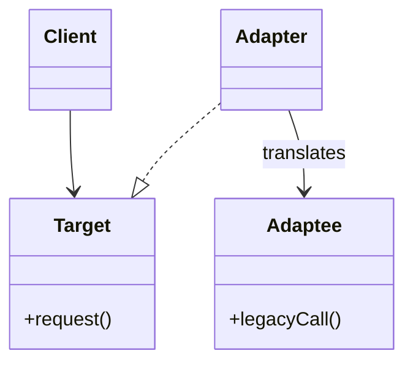
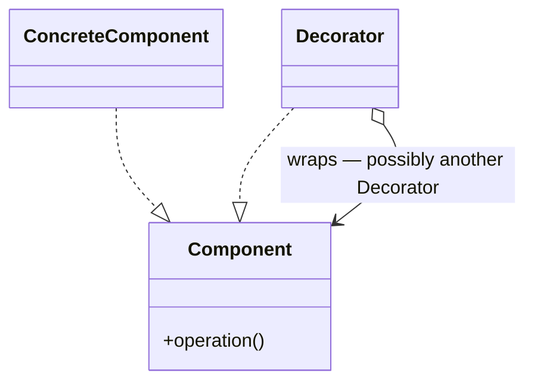
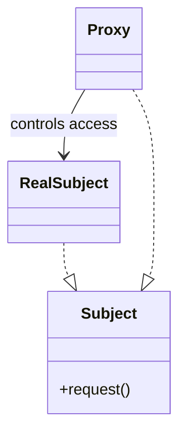

# Design patterns — the problem-shape index

The 23 patterns of *Design Patterns* (Gang of Four, 1994 — pinned in `standards.md`) are a **vocabulary for recurring problem shapes**, not a menu of good ideas. This file is organized around that: §1 is the catalog for orientation, §2 is the index you actually work from, §3 is how a pattern gets *into* working code, and §4 is how to get one back out.

**The rule this file enforces, stated once and applied throughout: a pattern is applied only when a recognized problem shape is ALREADY present in the code. Never speculatively.** "We might need to swap implementations later" is not a problem shape; three `if (type == …)` chains on the same type code is. If you cannot point at the shape in the existing source, the answer is no pattern — and adding one anyway is the failure mode §4 is about.

## 1. Catalog by family — the problem shape each answers

One line per pattern, naming the *problem*, not defining the *solution*. If none of these sentences describes your code, none of these patterns applies to it.

### Creational — object creation is coupling you to concrete types

| Pattern | The problem shape |
|---|---|
| **Abstract Factory** | Code must create whole *families* of related objects and must not know which family it is in. |
| **Builder** | Construction of one object takes many steps or many optional parameters, and the same steps must yield different representations. |
| **Factory Method** | A class must create a collaborator but cannot know its concrete type; subclasses decide. |
| **Prototype** | New instances are cheaper or clearer to make by copying an existing configured instance than by constructing one. |
| **Singleton** | Exactly one instance must exist and be globally reachable. *Usually a smell in modern code* — it is global mutable state with a nicer name, it fights dependency injection, and it makes tests order-dependent. Prefer a single instance supplied by the container or composition root. |

### Structural — objects need to be composed, wrapped, or hidden

| Pattern | The problem shape |
|---|---|
| **Adapter** | Two interfaces that must work together do not match, and you cannot change either. |
| **Bridge** | An abstraction and its implementation both vary, and inheritance would give you a combinatorial class explosion. |
| **Composite** | Clients must treat individual objects and compositions of objects uniformly (a tree). |
| **Decorator** | Responsibilities must be added to individual objects at runtime without subclassing every combination. |
| **Facade** | A subsystem is correct but its surface is too wide for the common case. |
| **Flyweight** | Very many objects differ only in a little state, and the shared part dominates memory. |
| **Proxy** | Access to an object must be controlled, deferred, or made remote without the client noticing. |

### Behavioral — responsibility and communication need a shape

| Pattern | The problem shape |
|---|---|
| **Chain of Responsibility** | Several handlers might process a request and the sender must not know which one does. |
| **Command** | A request must be turned into an object — to queue it, log it, undo it, or parameterize a caller with it. |
| **Interpreter** | A simple, stable language recurs and its grammar is worth representing as a class hierarchy. Rare; usually a parser generator wins. |
| **Iterator** | Elements of an aggregate must be traversed without exposing its representation. Built into most modern languages — apply the language's construct, not the pattern by hand. |
| **Mediator** | Many objects reference each other directly and the resulting graph is unmaintainable. |
| **Memento** | An object's state must be captured and restored later without breaking encapsulation. |
| **Observer** | State change in one object must notify an unknown, varying set of dependents. |
| **State** | An object's behavior changes with its internal state, and the transitions are scattered across conditionals. |
| **Strategy** | A family of interchangeable algorithms is selected at runtime, currently by a conditional. |
| **Template Method** | Several variants share an algorithm skeleton and differ only in specific steps. |
| **Visitor** | New operations must be added over a stable object structure without editing every class in it. |

## 2. Problem shape → pattern index

**This index, not the catalog, is what you read at work time.** Diagnose from the symptom in the left column.

| What the code looks like | Pattern to consider | Watch out for |
|---|---|---|
| `new ConcreteThing()` scattered through code that should not know the concrete type | **Factory Method**; **Abstract Factory** when related objects must vary together | A factory for exactly one concrete type is indirection with no payoff (§4). |
| A conditional on a **type code** or enum selecting *which algorithm to run*, repeated in several places | **Strategy** | If the conditional runs once and never repeats, a function parameter beats a class hierarchy. |
| A conditional on the object's own **lifecycle state**, with transitions scattered | **State** | State and Strategy have the same shape; State's objects change *which* one is current, Strategy's are chosen by the caller. |
| Two interfaces that must interoperate and neither can change | **Adapter** | If you *can* change one, changing it is simpler than adding a class. |
| Optional behavior added in varying combinations; a subclass per combination is looming | **Decorator** | Two decorators whose order matters and is undocumented is a bug factory. |
| A wide subsystem where callers repeat the same five-call sequence | **Facade** | A facade that grows a method per caller has become the subsystem again. |
| Objects and groups of objects handled by near-identical code paths | **Composite** | Only when the recursion is real; a two-level structure does not need it. |
| One change must notify a set of listeners the source should not know about | **Observer** (or the platform's event/stream primitive) | Language and framework mechanisms usually beat hand-rolling it. |
| Construction with many optional parameters, or telescoping constructors | **Builder** | In languages with named/default parameters this is often unnecessary. |
| An algorithm skeleton duplicated across siblings, differing in a few steps | **Template Method**, or **Strategy** for composition over inheritance | Inheritance couples the variants to the skeleton forever; prefer Strategy when the steps vary independently. |
| A new operation must be added over a stable, closed set of node types | **Visitor** | Only when the *type set* is stable and *operations* vary. If types vary more, Visitor is exactly backwards. |
| Objects wired into a dense many-to-many mesh | **Mediator** | A mediator that knows everything is a God Class with a pattern name (`refactoring-catalog.md` §1). |
| An operation must be undoable, queueable, or replayable | **Command** | Only if you actually need one of those three. |
| Cross-cutting access control, laziness, caching, or remoting around an existing object | **Proxy** | Often better served by the framework's interception or middleware. |

Two patterns worth naming as a pair, because they are the ones most often mixed up: **Strategy is chosen by the client; State changes itself.** If the object decides which behavior comes next, it is State.

## 3. Refactoring to patterns — how a pattern gets into working code

**Never as a big-bang rewrite.** A pattern is introduced through a sequence of small, individually behavior-preserving moves from `refactoring-catalog.md`, each with the tests green after it. That way the change is reversible at any step, and a red suite localizes to the last move rather than to "the rewrite".

The generic sequence:

1. **Name the smell first**, from `refactoring-catalog.md` §1 — usually *Repeated Switches*, *Large Class*, *Duplicated Code*, or *Divergent Change*. This is the §1 gate of `../SKILL.md`; without it, stop.
2. **Confirm the safety net** is green over the target (`refactoring-catalog.md` §3; tests delegated to `loop-test`).
3. **Isolate the varying part.** *Extract Function* on each branch or each varying step, so the thing that differs has a name and a boundary. Usually the largest single step, and often enough on its own — many "we need a pattern here" situations dissolve at this point, which is why it comes before introducing any type.
4. **Normalize the signatures.** *Change Function Declaration* until every extracted piece has the same shape. A pattern is only possible once the variants are interchangeable.
5. **Introduce the type.** Add the interface/abstract class and one implementation. Do not move anything yet.
6. **Move one variant at a time.** *Move Function* one branch into its implementation, run the tests, repeat. This is the step that must not be batched.
7. **Replace the dispatch.** Once every variant has moved, swap the conditional for the polymorphic call (*Replace Conditional with Polymorphism*) — a small step, because everything else already moved.
8. **Remove the scaffolding.** *Remove Dead Code*, *Inline Function* on anything the pattern made redundant, and delete the old type code if nothing reads it.

Steps 3–7 are each a green commit. If you cannot get to green between two of them, the step was too large — split it.

## 4. The anti-pattern: pattern-happy code

Applying patterns has a well-known failure mode, and it runs directly against the anti-over-engineering position `loop-scout` and `loop-design` take. This skill does not get to contradict its siblings, so the guardrail is explicit: **every pattern application cites the problem shape it answers, in the code, today.**

Recognize pattern-happy code by these tells:

- **A Factory (or Abstract Factory) for one concrete type**, with no second type in the codebase and none required.
- **An interface with exactly one implementer**, created "for testability" where the language's test tooling can already substitute the concrete type — or worse, mirrored one-to-one with its single implementation so every signature change edits two files.
- **A Strategy hierarchy over a conditional that never repeats and never varies.**
- **Indirection you cannot trace**: reading a value takes four hops through classes that only forward.
- **Configuration or registration ceremony** whose only job is to wire an abstraction with one option.
- **Pattern names in class names** (`OrderProcessingStrategyFactoryImpl`) doing the work that domain names should do.
- **Speculative hooks** — an abstract method nobody overrides, a parameter nobody varies. This is *Speculative Generality* (`refactoring-catalog.md` §1) and it is a smell in its own right.

**Simplifying back out is a legitimate output of this skill, and often the better one.** The moves are the same catalog, run in reverse: *Inline Class*, *Inline Function*, *Collapse Hierarchy*, *Remove Dead Code*, *Change Function Declaration* to drop unused parameters, *Replace Subclass with Delegate* where a hierarchy exists for one variant. Same discipline: small steps, tests green after each, behavior identical.

The honest test before adding any pattern: **name the second case.** If you cannot point at a real, existing second algorithm, second family, or second implementation, you are describing a future you do not have, and the pattern is a cost you pay now for a benefit that may never arrive.

## 5. Worked example — Strategy replacing a growing conditional

**Smell first (this is not optional).** In `PricingService`, a `switch (customer.tier)` selects the discount calculation. The same switch on `customer.tier` also appears in `InvoiceRenderer` and in `QuoteBuilder`. That is **Repeated Switches** (`refactoring-catalog.md` §1). The principle behind it: adding a tier means editing three files that have nothing to do with each other — an **Open/Closed** violation (`solid-and-style.md` §1). Two independent citations, so the gate is passed.

Starting point, roughly:

```
discountFor(customer, amount):
    switch customer.tier:
      case STANDARD: return 0
      case GOLD:     return amount * 0.05
      case PARTNER:  return amount * 0.10 + partnerBonus(customer)
```

**Step 1 — safety net.** Run the pricing tests. Green, and they cover all three tiers. (If they did not, `loop-test` writes the missing cases first — `refactoring-catalog.md` §3.)

**Step 2 — Extract Function per branch.** `standardDiscount(customer, amount)`, `goldDiscount(customer, amount)`, `partnerDiscount(customer, amount)`. The switch now has one call per arm. Tests green. Commit.

*This is the step that most often ends the job.* If the three functions are trivial and the switch exists in exactly one place, stop here — you have removed the duplication and a Strategy hierarchy would be the §4 failure mode.

**Step 3 — Change Function Declaration to align them.** All three now take `(customer, amount)` and return a decimal, even where a parameter is unused. Interchangeable signatures are a precondition for the pattern. Tests green. Commit.

**Step 4 — Introduce the type.** Add a `DiscountPolicy` interface with `discount(customer, amount)` and one implementation, `StandardDiscountPolicy`, delegating to the extracted function. Nothing calls it yet. Tests green. Commit.

**Step 5 — Move one variant at a time.** *Move Function* `goldDiscount` into `GoldDiscountPolicy`. Tests green. Commit. Repeat for `partnerDiscount`. **Do not batch these** — one move, one run, one commit.

**Step 6 — Replace Conditional with Polymorphism.** Introduce the lookup from tier to policy (a map in the composition root, or a field on the tier enum — the map keeps the tier type free of pricing knowledge). `discountFor` becomes `policyFor(customer.tier).discount(customer, amount)`. Tests green — *the same tests, unchanged*, which is the proof that behavior held. Commit.

**Step 7 — Propagate and clean up.** `InvoiceRenderer` and `QuoteBuilder` now call through the same lookup; their switches disappear. *Remove Dead Code* on the original per-tier branches. Tests green. Commit.

**What was bought.** Adding a tier is now one new class plus one map entry, in one place — the Open/Closed violation is gone and the Repeated Switches smell with it. **What was paid.** Three classes, one interface, and one lookup where there used to be one switch. That trade is only worth it because the switch was repeated *three times* and tiers demonstrably get added. With one switch and a stable tier set, step 2 was the correct stopping point — and knowing where to stop is the substance of §4.

## 6. Misuse-cost catalog — what the popular patterns cost when they ship wrong

§2 diagnoses when a pattern applies and §4 recognizes pattern-happy code before it merges. This section prices the misuses that merge anyway — the patterns people reach for first: what each is *for*, the wrong version that actually ships, and the cheaper construct that usually suffices in a language with first-class functions. The recurring finding: the misuse is rarely the pattern done badly. It is the pattern applied where its problem shape never existed, so the cost is pure and the benefit zero.

| Pattern | It is for | The misuse that ships | What the misuse costs, daily | What usually suffices |
|---|---|---|---|---|
| **Singleton** | Exactly one instance where a *second would be incorrect* (a hardware handle, a process-wide lock registry) — the narrow shape §1 already flags as usually a smell. | A convenient global: mutable state written from anywhere, reachable without appearing in any signature. | The coupling is invisible — no parameter names the dependency, so tests interact through state they never mention and cannot run in parallel: §1's order-dependence, priced per CI run. "Who changed this" is unanswerable from any call site. | Construct once at the composition root and pass it in (§1). Uniqueness is a wiring decision, not a property of the class. |
| **Observer** | One subject notifying a set of dependents it must not know (§2). | Observers that mutate state which fires other observers; subscriptions nobody disposes. | Cascade storms — one change fans out re-entrantly and causality vanishes from the stack trace. Leaked subscriptions pin dead objects in memory and keep delivering events into them. | The platform's event/stream/signal primitive with subscription lifetime owned explicitly. A plain list of callbacks plus a dispose handle covers most of the rest. |
| **Strategy** | Interchangeable algorithms behind one signature, where the selecting conditional *repeats* (§2, §5). | An interface, N classes, and a registry for a conditional that occurs once. | Five files where three lines were; every new variant is a class, a registration, and a naming debate; readers chase the dispatch to learn what runs. | Pass a function. A map from enum to function when selection is data-driven. |
| **Factory Method / Abstract Factory** | Creation that must vary by subclass; whole *families* that must vary together (§1). | The §4 tell shipped: a factory whose product count is one and will stay one. | Every "where is this created" answer gains a hop; the constructor's compile-time checking is traded for runtime wiring, for nothing. | Call the constructor. If a test needs a substitute, inject the *instance*, not a maker of instances. An Abstract Factory shrinks to a record of constructor functions. |
| **Decorator** | Independent responsibilities combined per-object at runtime, where a subclass per combination explodes (§1). | A five-deep wrapper stack assembled far from the call site, with order-dependent semantics nobody wrote down (§2's watch-out, realized). | Debugging is onion-peeling: a breakpoint on the real work sits under N forwarding frames, and the stack trace is all wrapper. Reordering two wrappers changes behavior silently. | The framework's middleware/pipeline if one exists; otherwise compose functions. If the combinations never actually vary at runtime, it is a field on the class. |
| **Adapter** | Two interfaces that must meet when you can change *neither* (§2). | An adapter class over an interface you own — or one that quietly grows logic until it is a shadow domain layer. | A permanent extra type doing what a rename would have done; business rules hidden where nobody looks for business rules. | Change the interface you own (§2). Where one side is a function type, a converter function at the call site *is* the whole pattern. |
| **Facade** | A narrow, stable entry point over a wide subsystem's common case (§2). | §2's watch-out realized — a method per caller until the facade is the subsystem's surface plus one hop; or it hides so much that callers bypass it, leaving two live entry points. | You maintain the subsystem *and* its echo: every subsystem change is designed twice and reviewed twice, and the two surfaces drift. | A module with a deliberately small export list. In most languages the facade is a file, not a class. |
| **Visitor** | Double dispatch: operations that churn over an element set that does *not* (§2). | Visitor over an element set that does churn. | Exactly inverted rigidity (§2): each new element type edits every visitor in the codebase — an N×M edit matrix growing on the wrong axis, plus the accept-method boilerplate on every node. | Pattern matching over a sealed/union type, where the compiler names every match a new element breaks. A map from type to function where matching is unavailable. |
| **Builder** | Multi-step construction where the same steps must yield different representations (§1). | A builder mirroring every field of one class, in a language that has named and default arguments (§2). | Double the API surface; every field change edits two places; objects escape half-built when the only validation lives in `build()`. | Named/default arguments; records/dataclasses; a validating constructor. The construction problem GoF Builder solves mostly does not exist in these languages. |

The fourth column is the argument. Each cost is paid at every debugging session, test run, and field change — while the pattern's benefit was contingent on a second case that, per §4's honest test, never arrived.

### 6.1 Decorator, Proxy, Adapter, Facade — the wrapper line-up

Four patterns all produce "a class holding another object and forwarding calls," and misdiagnosis among them is common enough to earn the only diagrams in this file. The shapes differ on exactly two questions: **does the interface change**, and **what does the wrapper add**.



**Adapter** changes the interface and adds nothing else. If behavior is being added, it is not an Adapter.



**Decorator** keeps the interface and adds behavior. Its reference points at `Component`, not `ConcreteComponent` — that is what lets decorators stack, and stacking is the point.



**Proxy** keeps the interface and controls *access* — laziness, caching, remoting, permission. There is one proxy, not a stack, and the client must not be able to tell it is there.

| Question | Adapter | Decorator | Proxy | Facade |
|---|---|---|---|---|
| Interface changes? | Yes — that is the job | No | No | Yes — a new, smaller one |
| Adds behavior? | No | Yes | No — gates access | No — sequences calls |
| Stacks? | No | Yes — the point | No | No |
| Wraps how many objects? | One | One, recursively | One | Many |

Section 7 — Pattern → modern-language replacement (append after §6)
## 7. Pattern → what a modern language already gives you

A large share of the GoF catalog compensates for what its 1994 implementation languages could not say cheaply: C++ had no closures, and neither C++ nor Smalltalk had sum types with compiler-checked matching. Where the language provides the mechanism, use the mechanism — the pattern's *name* still earns its keep in conversation and review, but the class structure does not.

| Pattern | The language construct that replaces it | What the construct does *not* give you |
|---|---|---|
| Strategy | A function argument; a lambda | A home for per-variant *state* — if variants carry configuration, a closure or a small class returns |
| Command | A closure — the function plus its captured arguments | Undo: the inverse operation must still be written explicitly |
| Template Method | A function taking its varying steps as function parameters | A subclass's ability to override later without touching the call site |
| Factory Method | A function returning the type; a constructor reference | Nothing, in the single-product case |
| Abstract Factory | A record or module of constructor functions | Nothing, once families are just values |
| Observer | Events, streams, signals, channels — whatever the platform ships | Disposal discipline: the lifetime leak of §6 survives the syntax change |
| Iterator | The iteration protocol; generators | Nothing — never hand-roll this (§1) |
| Singleton | A module-level value; a container-scoped instance | Global reach from anywhere — losing that is the point |
| Decorator | Function composition; a middleware chain | Per-wrapper state, on the occasions a wrapper genuinely carries some |
| Visitor | Pattern matching over sealed/union types | Visitor accumulates state across visits naturally; with matching you thread it yourself |
| Builder | Named + default arguments; records/dataclasses | Enforced step ordering, in the rare case steps genuinely must run in sequence |
| State | Sum types + match; sometimes a coroutine that *is* the machine | Nothing at small scale; a State class earns its keep only when transitions carry behavior |

The replacements are not automatically better — a lambda with three captured locals is a Strategy with worse discoverability. The rule stays §2's: diagnose the problem shape first, then reach for the *cheapest* construct that answers it, which in a modern language is usually not a class.

Drafting notes for the caller
- Target file (unmodified, per brief): /mnt/data/company/TheLoopSkill/.claude/skills/loop-pattern/references/design-patterns.md — existing numbering ends at §5, so the draft continues at §6/§7.
- Additivity: the file already flags Singleton (§1), one-product factories and once-only Strategy conditionals (§2 watch-outs, §4 tells), Builder-vs-named-args (§2), and Visitor inversion (§2). The new §6 cites those anchors and adds only the *cost accounting* of the misuse once shipped — it does not restate the diagnosis.
- Diagrams: exactly three mermaid class sketches (Adapter, Decorator, Proxy), per the brief's 3–4 limit, plus a 4-way discriminator table including Facade. No loop-pattern sibling uses diagrams — these are the first in this directory; the inline-mermaid precedent within the plugin is `loop-design/references/architecture-patterns.md` (a different skill's reference, not a sibling). The C4-to-SVG rule in project memory applies to product docs, not these skill references.
- Attribution discipline: GoF's example languages were C++ and Smalltalk (certain); the closure gap is attributed to C++ only — Smalltalk blocks are first-class closures — and the sum-type gap to both. The functions-replace-patterns idea is stated without attribution or counts, per the rules.
- Length: the two sections total roughly 95 lines, under the ~120 budget.
