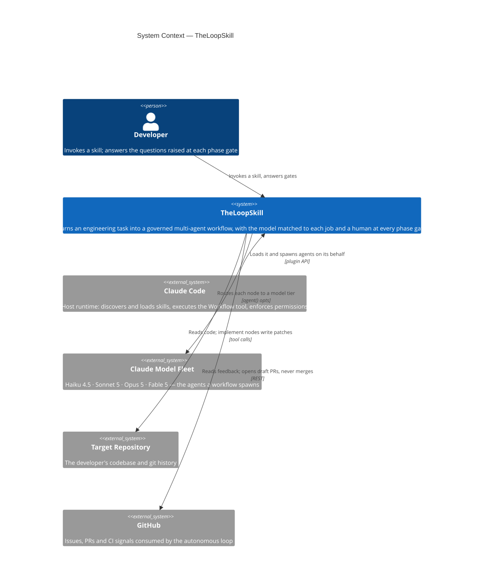

# Heimdall

> **Run real engineering work as governed, multi-agent workflows** — a Claude Code plugin of 22 composable skills covering the whole lifecycle, from design and review through shipping, operating, and autonomous self-improvement.

[](LICENSE)
[](#whats-in-the-box)
[](#installation)
[](CONTRIBUTING.md)

Heimdall turns a task into a **multi-agent Workflow** — pipeline by default, parallel fan-out where it's earned, loops for unknown-size discovery — governed by explicit engineering policies and a pluggable lifecycle framework. Eighteen domain skills build on that engine to cover the lifecycle end to end — design, mechanism, build, review, integrate, ship, operate, respond — and one autonomous skill ties them into a self-improving loop.

Every node of every workflow is routed to a model tier that matches the job, on one dial with three rungs: **`lite`** for small tasks, **`balanced`** (the default) for real work, **`all-out`** when the answer matters more than the bill.

## Contents

- [Why](#why)
- [What's in the box](#whats-in-the-box)
- [Quickstart](#quickstart)
- [Architecture at a glance](#architecture-at-a-glance)
- [The `loop-engine`](#the-loop-engine)
- [Execution modes](#execution-modes--one-dial-for-the-whole-fleet)
- [Engineering policies & discipline](#engineering-policies--discipline)
- [Installation](#installation)
- [Repository layout](#repository-layout)
- [Roadmap](#roadmap)
- [Contributing](#contributing)
- [License](#license)

## Why

A single agent handed a big task drifts: it skips verification, forgets what it already did, and hides how confident it is. Heimdall answers that with **structure** — the same three moves the best engineers make, encoded as reusable skills:

- **Decompose and fan out** so breadth is covered in parallel, not serially.
- **Verify adversarially** — findings must survive a refutation attempt before they're reported.
- **Stay in the loop** — human gates between lifecycle phases; the loop proposes, a person approves.

It's for developers who want Claude Code to do *engineering*, not just answer questions — auditing a PR, designing a service, hunting a bug to root cause, or running an unattended improvement loop over a repo — with the rigor made explicit and the model choice matched to the job.

## What's in the box

Twenty-two skills, grouped by the engineering role they play. Every skill takes `[--mode <lite|balanced|all-out>]` unless noted.

**Start here — say what is in front of you, and one row applies:**

| You have... | Reach for |
|---|---|
| An idea and nothing else | `loop-build` (whole project) or `loop-design` (just the architecture) |
| A big job to split across many agents | `loop-orchestrate` to plan it, `loop-engine` to run one workflow |
| Code that is wrong, and you can run it | `loop-debug` |
| Code that works but is slow, messy, or unidiomatic | `loop-algo` (mechanism) / `loop-pattern` (shape) |
| A diff, PR, or repo to judge without changing it | `loop-review` (defects) / `loop-audit` (impact & risk) |
| A UI that renders but feels cheap | `loop-frontend` |
| A third-party API to wire up | `loop-integrate` (`loop-scout` first if the provider isn't chosen) |
| A change ready to reach production | `loop-ship` — including many task branches to land as one (see the integration train below) |
| A live service to keep healthy / a live outage | `loop-operate` / `loop-incident` |
| A question needing cited evidence | `loop-research` |
| Docs to write or fix | `loop-docs` |
| An agent that forgets, repeats itself, or acts on stale facts | `loop-context` |
| Claude's own setup: permissions, hooks, MCP, schedules | `loop-harness` |
| A repo that should improve itself on a schedule | `loop-autopilot` |
| A new skill for this plugin | `loop-skill` |

**Engine & planning**

| Skill | Invoke | What it does |
|---|---|---|
| **loop-engine** | `/loop-engine <task> [--planner <opus\|fable>] [--framework <name>] [--dry-run]` | Authors and executes a multi-agent Workflow script — pipeline by default, earned parallel barriers, loops for unknown-size discovery — governed by the harness & loop policies and a lifecycle framework (default AIDLC). |
| **loop-orchestrate** | `/loop-orchestrate <project> [--planner <opus\|fable>] [--budget <tokens>]` | Planning layer on `loop-engine`: decomposes a project into a task DAG and routes the right Claude model + effort to each task ("right model for the right job"). |
| **loop-context** | `/loop-context <target>` | What an agent **carries** at runtime: context budgets and placement, compaction with an addressable store, typed shared state (per-field merge rules, phase checkpoints) handed between agents, supersession of stale facts, and evidence-confirmed audits via four trace invariants. |
| **loop-skill** | `/loop-skill <skill-purpose>` | Authors a new skill for this plugin, or brings an existing one up to contract: discriminating description, graded standards shelf, thin router, references, ROUTES-carrying template — then proves it with the validation gate. |
| **loop-build** | `/loop-build <project-brief>` | Conducts a brief to a shipped version one: scopes the v1 contract, plans with three reconciled planners plus a roster sweep, drives every phase through the owning domain skills with sequential gates and repair rounds, releases, and ships the full cast-and-cost ledger. |

**Design & mechanism**

| Skill | Invoke | What it does |
|---|---|---|
| **loop-design** | `/loop-design <system>` | Architecture at component granularity: pattern selection, API design, backend/data modeling, frontend performance, NFR and SLO *targets*. Emits ADRs + C4 diagrams. No `--mode` — it ships no workflow template. |
| **loop-algo** | `/loop-algo <mechanism>` | The mechanism *inside* a component: algorithm and data-structure choice, complexity analysis, invariants and correctness arguments, concurrency, benchmark-driven validation. |
| **loop-pattern** | `/loop-pattern <target>` | Applies GoF patterns, Fowler refactorings, SOLID and language/framework idioms — and removes the smells that motivate them. Emits a **diff**; `loop-review` emits findings. |
| **loop-frontend** | `/loop-frontend <surface>` | How an interface *feels* frame by frame: motion choreography, easing and duration budgets, stagger, shared-element continuity, type scale, perceived performance. Enforces `prefers-reduced-motion` and the WCAG flash limits as gates. |

**Build & verify**

| Skill | Invoke | What it does |
|---|---|---|
| **loop-test** | `/loop-test <target>` | Designs and writes tests (happy/edge/error/property), matches the repo's stack, and verifies each runs and fails for the right reason. |
| **loop-review** | `/loop-review <target>` | Security + quality review against OWASP Top 10:2025, the 2025 CWE Top 25, ASVS 5.0 and CVSS v4. Finder-per-category → dedup → adversarial verify. |
| **loop-audit** | `/loop-audit <diff\|PR\|range>` | Change/impact **report**: classifies changes, traces blast radius, rates risk, checks coverage; delegates the security dimension to `loop-review`. |
| **loop-debug** | `/loop-debug <symptom>` | Hypothesis-driven debugging on a **reproducible defect**: reproduce → localize → root-cause → minimal fix → regression test. |

**Integrate & ship**

| Skill | Invoke | What it does |
|---|---|---|
| **loop-integrate** | `/loop-integrate <integration>` | Third-party, cloud and SaaS integration: OAuth 2.0 / OIDC, token and secret handling, webhook verification, idempotency keys, rate limits, retry and backoff, contract tests. |
| **loop-ship** | `/loop-ship <change>` | Getting a change safely to production: rollout strategy (rolling, blue-green, canary), feature flags, expand-contract migrations, release checklist and go/no-go, tested rollback, DORA. |

**Run & respond**

| Skill | Invoke | What it does |
|---|---|---|
| **loop-operate** | `/loop-operate <service>` | Steady-state operation: SLIs, SLOs and error budgets, burn-rate alerts, self-healing runbooks, SLO-gated auto-rollback. Owns automated mitigation of **known** conditions. |
| **loop-incident** | `/loop-incident <incident>` | A **live, user-impacting** failure: severity triage, comms and roles, mitigate *before* diagnosing, reproduction harness, timeline, blameless postmortem. |

**Knowledge & automation**

| Skill | Invoke | What it does |
|---|---|---|
| **loop-research** | `/loop-research <question>` | Multi-source research with adversarial fact-checking: search fan-out → deep-read → refute-first verify → cited synthesis. Every claim carries a source. |
| **loop-scout** | `/loop-scout <need>` | Prior-art / build-vs-buy check *before* building: stdlib → registries → services → standards. Guards against over-engineering. |
| **loop-docs** | `/loop-docs <target>` | Writes/maintains docs (README, API, docstrings, ADRs) via the Diátaxis model, verifying every claim against the code. |
| **loop-harness** | `/loop-harness <project>` | Sets up a project's Claude Code harness from copy-paste scaffolds: permissions, hooks, MCP (`.mcp.json`), automation loops. No `--mode` — it ships no workflow template. |
| **loop-autopilot** | `/loop-autopilot <repo>` | Autonomous engineering loop — reads feedback (issues/PRs/CI), acts as **draft** PRs with tests, researches improvements when idle. Propose-only, never merges. |

**Which one when?** The four operational skills are the easiest to confuse, so they split on one checkable question each: is there a runbook that restores the SLI (`loop-operate`) or not (`loop-incident`)? Is the service currently down (`loop-incident`) or is the defect merely reproducible (`loop-debug`)? Is the rollout still in flight (`loop-ship`) or baked (`loop-operate`)? The full 20-way matrix is in [`docs/design/boundary-audit.json`](docs/design/boundary-audit.json).

## Branch-per-task and the integration train

When one project has several pieces of work in flight at once, the fleet runs them **one branch per task** and lands them **as one gated unit**:

1. **Branch per task.** Parallel file-mutating agents each get their own git worktree and their own `claude/`- or `feature/`-prefixed branch (harness policy H7 — two writers in one checkout is the AP5 anti-pattern). `loop-autopilot` does this per intake item; `loop-engine` does it for any workflow via `isolation: 'worktree'`.
2. **Collect onto a train.** When the tasks are done, cut `integration/<milestone>` from `develop`, merge the task branches onto it in declared dependency order, and resolve conflicts once, on the train — the procedure, the drop-a-wagon revert rule, and when a train is *not* worth it are in [`loop-ship/references/integration-train.md`](.claude/skills/loop-ship/references/integration-train.md).
3. **One gate, one merge.** The expensive checks run once on the train; it lands in `develop` as a single reviewed unit, and promotion to `main` follows `loop-ship`'s release gates.

What crosses those branch boundaries is a contract, not prose: `loop-context` owns the typed state, merge rules, and decision-carrying handoffs that keep parallel workers from making individually reasonable, mutually incompatible choices.

## Quickstart

```
# 1. Add the marketplace and install the plugin
/plugin marketplace add santapong/Heimdall
/plugin install heimdall@heimdall

# 2. Run your first workflow (dry-run shows the script without executing)
/loop-engine audit this repo's docs for quality issues --dry-run

# 3. Or reach for a domain skill directly
/loop-review the changes on this branch
/loop-scout I need to add rate limiting to an Express API
```

No install needed to try it inside this repo — the skills live in `.claude/skills/` and are auto-discovered by any Claude Code session opened here. See [Installation](#installation) for local, web, and plugin paths.

## Architecture at a glance

The system is documented with the **[C4 model](https://c4model.com)** — a hierarchy of diagrams at decreasing altitude, where each level answers one question and refuses to answer the next level's. Level 1 is below; the rest live in **[`docs/c4/`](docs/c4/README.md)**.

### Level 1 — System Context

**What is this, who uses it, what does it depend on?** Note where the boundary sits: Claude Code is *outside* it. The plugin has no process, port, or lifecycle of its own — everything it "does" is done by the host on its instruction.



<sub>Diagram source: [`docs/c4/diagrams/src/context-glance.mmd`](docs/c4/diagrams/src/context-glance.mmd) · regenerate with `node scripts/render-diagrams.mjs`</sub>

### Level 2 — Containers

Eight separately-loadable units, split by **loading regime**, which is the meaningful boundary for a plugin with no server: a `SKILL.md` enters agent context on invocation, a `references/*.md` loads only if the router asks for it, and a `*.workflow.js` is never read into context at all — it is *executed* in a sandbox with no filesystem, clock, or module system. That sandbox is what forces the routing block to be duplicated rather than imported. → **[Container diagram](docs/c4/container.md)**

### Level 3 — How the skills compose

The skills aren't a flat list — they build on `loop-engine` and **delegate rather than duplicate**. Every edge below is a boundary that would otherwise be an overlap:


<sub>Diagram source: [`docs/c4/diagrams/src/skill-composition.mmd`](docs/c4/diagrams/src/skill-composition.mmd) · regenerate with `node scripts/render-diagrams.mjs`</sub>

The five relationships running `loop-operate → loop-incident → loop-debug → loop-test → loop-ship → loop-operate` form a **closed cycle**, and that cycle is the reason those five are separate skills rather than one: `loop-operate` detects and auto-mitigates *known* conditions → `loop-incident` takes *novel* ones, mitigating before diagnosing → `loop-debug` finds the defect once the service is back → `loop-test` locks it with a regression → `loop-ship` redeploys → `loop-operate` owns it again once the rollout bakes.

Each handoff is a **checkable question**, not a judgment call: *does a runbook exist and does running it restore the SLI?* · *is the service currently down, or is the defect merely reproducible?* · *is the rollout in flight, or baked?* The full 20-way matrix is in **[`docs/design/boundary-audit.json`](docs/design/boundary-audit.json)**, which is normative — it outranks any plan that disagrees with it.

→ **[Component diagram](docs/c4/component.md)** opens `loop-engine` itself · **[the skill fleet](docs/c4/skills.md)** draws each role group and what is inside any one skill · **[skill anatomy](docs/c4/skill-anatomy.md)** explains why that shape · **[the architecture notes](docs/c4/README.md)** trace one invocation end to end with the prior art behind each idea.

## The autonomy ladder

The plugin isn’t only twenty-two skills — it's a **progression of autonomy**. Four rungs, each removing one unit of human involvement from the engineering loop. The rule is the whole discipline: **you climb only when the rung below is solid.** The human never disappears; they move from *doing the work*, to *approving it*, to *reading the alarms*, to *handling the exceptions*.



<sub>Diagram source: [`docs/c4/diagrams/src/autonomy-ladder.mmd`](docs/c4/diagrams/src/autonomy-ladder.mmd) · regenerate with `node scripts/render-diagrams.mjs`</sub>

> **Why this one isn't a C4 diagram.** Every other diagram in this repo is C4 ([Context](#level-1--system-context) · [Container](docs/c4/container.md) · [Component](docs/c4/component.md)). This one isn't, deliberately: C4 models *structure* — systems, containers, components and the relationships between them — and a rung is not a component. "Degrades one rung down on an alarm" is a state transition, not a dependency. Drawing it in C4 notation would render, and would be semantically false. C4's own guidance is that it is a set of static structure diagrams, complemented by other notations where a different question is being asked; this is one of those.

| Rung | The loop does | The human does | Implemented by | Status |
|---|---|---|---|---|
| **OBSERVE** | Reports findings; takes no action | Reads the report, decides | `loop-audit`, `loop-review` | ✅ shipped |
| **VERIFY** | Acts on a `claude/` branch, verifies adversarially, opens a draft PR | Approves and merges | `loop-autopilot` (default mode) | ✅ shipped |
| **SUSTAIN** | Detects when its own verifier is gamed or the loop meta-overfits | Reads the alarms; freezes config on a trip | `references/verifier-integrity.md` + `references/held-out-eval.md` | ✅ shipped |
| **SCALE** | Merges behind a canary and rolls itself back on a bad signal | Handles the exceptions a rollback raises | `references/deployment.md` §Advanced + `templates/canary-merge.workflow.js` | 🔒 off by default |

**Why SCALE is off by default — and why the ladder is sound anyway.** No production system removes the human from the merge step for *general* code (the ones that auto-ship do it only for narrow classes where CI is a complete spec). So SCALE ships as a **gated, reversible design draft**, not a proven recipe: it is enabled per-kind, only while every SUSTAIN signal is green, and it revokes its own autonomy the moment an alarm fires. That is the property that makes the whole ladder safe to climb — **it degrades downward.** SUSTAIN alarms freeze the loop; a SCALE trip drops it back to VERIFY; and VERIFY's floor — propose-only, a human merges — is always there to catch it. The worst case is never a runaway loop. It's a loop that quietly goes back to asking permission.

## The `loop-engine`

```
/loop-engine <task> [--framework <name>] [--dry-run]
```

Examples:

```
/loop-engine audit this codebase for security issues
/loop-engine build the CSV export feature --framework AIDLC
/loop-engine find all flaky tests --dry-run
```

- `--framework <name>` — the lifecycle framework governing the phases (default `AIDLC`; resolves to `.claude/skills/loop-engine/frameworks/<name>.md`)
- `--dry-run` — author and show the workflow script without executing it

When invoked, the skill reads the two engineering policies and the chosen framework → maps the task onto the framework's phases → picks the orchestration shape (pipeline by default; barriers and loops only where the policies allow) → authors a script from the JS templates → runs it via the Workflow tool → reports results, pausing at the framework's human gates.

### What a run looks like

For `/loop-engine audit the docs for quality issues`, the skill authors a script from `templates/pipeline.workflow.js` — an Analyze stage fanning out one agent per file, feeding a Verify stage that adversarially checks each finding — and executes it. A real run of that shape produced:

```
Analyze  ✔ analyze:README.md            ✔ analyze:frameworks/AIDLC.md
Verify   ✔ verify:… ×4  (3 findings refuted, 1 confirmed)
→ { confirmed: [{ title: "No example of output…", location: "README.md:24", ... }] }
```

Confirmed findings come back as structured data, with everything the verifiers refuted filtered out. With `--dry-run` you get the authored script itself; when a framework phase ends at a human gate, the run stops and presents that phase's deliverable for approval.

## Execution modes — one dial for the whole fleet

Every workflow node carries a `taskType`. A shared routing block maps that type, plus the mode, to a model and an effort level — so a mechanical enumeration and an adversarial security verdict never cost the same.

```
/loop-review the auth changes on this branch                 # balanced (default)
/loop-review the auth changes on this branch --mode lite     # small task, minimal spend
/loop-review the auth changes on this branch --mode all-out  # spare nothing
```

| | `--mode lite` | `--mode balanced` (default) | `--mode all-out` |
|---|---|---|---|
| Reach for it when | Small, well-specified task | Real production work | The answer matters more than the bill |
| Mechanical / scout / doc | Haiku 4.5 | Haiku 4.5 | Opus 5, `xhigh` |
| Implementation | Sonnet 5 | Sonnet 5, `high` | Opus 5, `xhigh` |
| Judgment / verify / critic | Sonnet 5, `medium` | inherit, `high` | Opus 5, `xhigh` |
| Gating & planner | **Opus 5** — pinned in every mode | **Opus 5** | **Opus 5**, `max` |
| Wide fan-out pushes a tier **down** | active | active | **disabled** |
| Verifier width | 1 | 1, or 3 when thorough | 3 (5 on a gating verify) |
| Loop-until-dry threshold | 1 | 2 | 3 |
| Pre-flight | none | none | estimate + **one confirmation before anything spawns** |
| Typical spend vs balanced | ≈0.2–0.4× | 1× | ≈3–5× |

Two things are deliberate. **Gating and planner nodes stay on Opus 5 even in `lite`** — they are single nodes whose wrong answer is inherited by everything downstream, so cheapening them buys a worse version of every task that follows. And **`lite` never inherits the session model**: it pins downward, because inheriting an Opus 5 session would make the cheapest-named mode the most expensive one on half the DAG.

The load-bearing difference at the top of the ladder is not the effort floor — it is that `all-out` **disables the tier-down modifier**, so a 300-item sweep `balanced` would route to Haiku runs entirely on Opus 5. That is where the cost goes, which is why `all-out` prices the DAG and asks once before spending it.

The v1.1 names `optimize` and `full` still work as deprecated aliases, so nothing that already runs breaks.

`--planner fable` is an orthogonal opt-in that routes the single planning node to Fable 5 for a deeper decomposition, and states its own tradeoffs at the point of use. Full contract: [`execution-modes.md`](.claude/skills/loop-engine/references/execution-modes.md).

## Engineering policies & discipline

Every authored workflow obeys three policy documents:

- **[Harness Engineering Policy](.claude/skills/loop-engine/references/harness-policy.md)** — orchestration design: pipeline vs. earned parallel barriers, adversarial/diverse-lens verification, budget & concurrency, isolation, phase discipline.
- **[Loop Engineering Policy](.claude/skills/loop-engine/references/loop-policy.md)** — iteration: loop-until-dry, budget-guarded loops, seen-set convergence, runaway prevention.
- **[Execution Modes](.claude/skills/loop-engine/references/execution-modes.md)** — per-node model routing, the two modes, and the full-mode pre-flight.

Lifecycle is governed by a **pluggable framework** — the default **AIDLC** (Inception → Construction → Operation, each ending at a human gate). Drop a new `frameworks/<Name>.md` in and invoke with `--framework <Name>`.

**The boundaries are a committed artifact.** With twenty-two skills, selection happens on the `description` field alone — so the mutually-exclusive scope matrix lives in [`docs/design/boundary-audit.json`](docs/design/boundary-audit.json) and outranks any build plan that disagrees with it.

**The gate can fail.** `node scripts/validate.mjs` runs in CI and rejects unparseable frontmatter, routing-block drift, banned clock/random calls in templates, and dangling reference paths. It was accepted only after a deliberately injected fault made it fail.

**Standards-grade knowledge.** Every skill carries a `references/standards.md` that names, version-pins, and maps the authoritative standards it applies — e.g. OWASP / CWE / CVSS v4 / NIST SSDF / SLSA for review, C4 / ISO-25010 / Google SRE for design, CRAAP / SIFT / PRISMA / GRADE for research, ISO 31000 for change audit, 5 Whys / ODC / OpenTelemetry for debugging. Skills reason from cited, edition-pinned standards, not vibes.

## Installation

Three ways to use these skills — see **[INSTALL.md](INSTALL.md)** for full detail.

- **Local (project skills)** — the skills live in `.claude/skills/` and are auto-discovered in any Claude Code session opened in this repo. Copy an individual skill directory into another project's `.claude/skills/` to reuse it.
- **Remote (Claude Code on the web)** — web sessions see only committed project files; everything here is committed. Open the repo on [code.claude.com](https://code.claude.com) and the skills are available. `.claude/settings.json` enables the plugin for web sessions.
- **Plugin (marketplace)** — `/plugin marketplace add santapong/Heimdall` then `/plugin install heimdall@heimdall`.

## Repository layout

Every skill follows the same shape: `SKILL.md` (thin router) + `references/` (deep knowledge, incl. a `standards.md`) + `templates/` (runnable workflow scripts or scaffolds).

| Path | What it is |
|---|---|
| `.claude/skills/loop-engine/` | The engine: `SKILL.md`, `references/` (harness & loop policies, **execution-modes**, standards), `templates/` (pipeline, parallel, loop-until-dry, loop-until-budget), `frameworks/` (AIDLC + scaffold) |
| `.claude/skills/loop-review/` | Security + quality review: methodology, OWASP/CWE, playbooks, severity model, standards, `security-review.workflow.js` |
| `.claude/skills/loop-design/` | Architecture: patterns, API, backend, frontend, deployment, NFR, standards; ADR + C4 templates |
| `.claude/skills/loop-orchestrate/` | Model routing + task decomposition + standards; `project-plan.workflow.js` |
| `.claude/skills/loop-research/` | Methodology, source evaluation, standards; `research.workflow.js` |
| `.claude/skills/loop-audit/` | Methodology, report template, standards; `change-audit.workflow.js` |
| `.claude/skills/loop-test/` | Test design, framework conventions, standards; `test-generation.workflow.js` |
| `.claude/skills/loop-debug/` | Methodology, hypothesis testing, standards; `bug-diagnosis.workflow.js` |
| `.claude/skills/loop-docs/` | Doc types, style, standards; `doc-generation.workflow.js` |
| `.claude/skills/loop-scout/` | Where to look, evaluation criteria, build-vs-buy, standards; `prior-art-search.workflow.js` |
| `.claude/skills/loop-harness/` | Permissions, hooks, mcp, automation-loops, standards; settings/mcp/hook scaffolds |
| `.claude/skills/loop-autopilot/` | Loop-design, feedback-intake, deployment (incl. SCALE), anti-patterns, comprehension-rot, credit-horizon, verifier-integrity + held-out-eval (the SUSTAIN rung), standards; loop + ledger + routine + held-out-eval + verifier-canary + canary-merge templates |
| `.claude/skills/loop-algo/` | Complexity & structures, correctness, concurrency, randomized structures, benchmarking, standards; `algorithm-bakeoff.workflow.js` |
| `.claude/skills/loop-pattern/` | Design patterns, refactoring catalog, SOLID & style, framework idioms, standards; `refactor-sweep.workflow.js` |
| `.claude/skills/loop-integrate/` | Auth & secrets, webhooks & idempotency, resilience, contracts & promotion, standards; `integration-readiness-audit.workflow.js` |
| `.claude/skills/loop-ship/` | Rollout strategies, migrations, DORA, release gates, supply-chain gate, rollback playbook, standards; `release-readiness-gate.workflow.js` |
| `.claude/skills/loop-operate/` | SLO model, alerting, observability, runbooks, on-call triage, autonomy & rollback, standards; `health-response.workflow.js` |
| `.claude/skills/loop-incident/` | Incident command, mitigation playbook, reproduction & timeline, postmortem, standards; `incident-reconstruction.workflow.js` |
| `docs/c4/` | **Architecture**, documented with the C4 model: context, container, component, the skill fleet, skill anatomy, plus the mechanism, ideas and references |
| `docs/design/` | **Normative design records** — the 18-skill boundary audit and the execution-mode spec |
| `docs/plans/` | Release build plans |
| `mcp/` | **`heimdall-mcp`** — the zero-dependency stdio MCP server (five tools + read-only skill resources), its ADR and its tool contracts |
| `scripts/validate.mjs` | The validation gate, run by `.github/workflows/validate.yml` on every push and PR |
| `scripts/pack-host.mjs`, `host-targets.json`, `check-host-packs.mjs` | The per-host packaging seam: descriptors in, `dist/<host>/` out, gated ([ADR-0008](docs/design/ADR-0008-host-packaging-seam.md)) |
| `.claude-plugin/plugin.json`, `marketplace.json` | Plugin + marketplace manifests |
| `.claude/settings.json` | Enables the plugin for Claude Code on the web |
| `INSTALL.md`, `CONTRIBUTING.md`, `CHANGELOG.md`, `ROADMAP.md` | Install paths, contributor guide, version history, what's proposed next |

## Roadmap

One track, milestones H0–H5. **[ROADMAP.md](ROADMAP.md)** carries it in full, with per-host detail and a gate per milestone.

**Host portability** *(in progress — H0 and H1's code side have landed)* — run Heimdall outside Claude Code, starting with **Cursor, OpenAI Codex and Antigravity**, more to follow.

`.claude/skills/` stays the single source of truth; each host's tree is **generated**, never hand-maintained ([ADR-0008](docs/design/ADR-0008-host-packaging-seam.md)):

```sh
node scripts/pack-host.mjs --all      # → dist/cursor/, dist/codex/, dist/antigravity/
node scripts/check-host-packs.mjs     # determinism, held-back skills, dangling pointers, banners
```

What that honestly buys per host — the caveats *are* the point:

| Tier | State |
|---|---|
| **A — skills load** | **18 of 22.** `loop-engine`, `loop-harness`, `loop-skill` and `loop-autopilot` are Claude Code-native *by subject* — the `Workflow` tool, `.claude/settings.json`, this repo's own gate, Routines — so they are held back rather than mistranslated. |
| **B — MCP tools reachable** | Emitted per host in its own dialect (`mcpServers` JSON, Antigravity's `mcp_config.json`, Codex's TOML `[mcp_servers.*]`). The launch path is absolute and resolved at pack time, so re-pack if the checkout moves; `node` stays a prerequisite. |
| **C — multi-agent execution** | **Claude Code only.** The 28 `*.workflow.js` templates target a tool no other host has, so they are excluded and every affected skill carries a generated note saying so, instead of quietly degrading to a single-agent answer. |

**No pack has been installed into a real session of any of the three hosts yet** — they build and pass their gate, nothing more. Instructions to try one: [INSTALL §4](INSTALL.md).

## Contributing

Contributions welcome — new skills, deeper reference standards, more frameworks. See **[CONTRIBUTING.md](CONTRIBUTING.md)** for the `SKILL.md` conventions, the workflow-template rules (including the runtime constraints), and how to validate a change (`claude plugin validate --strict`, `node --check`).

## License

[MIT](LICENSE) © santapong
