# Heimdall

> Run real engineering work as governed, multi-agent workflows — a Claude Code plugin of **24 composable skills** covering the whole lifecycle, from understanding and design through shipping, operating, and autonomous self-improvement.

[](LICENSE)
[](#the-skills)
[](#installation)
[](CONTRIBUTING.md)

Heimdall turns a task into a multi-agent workflow — pipeline by default, parallel fan-out where it is earned, loops for unknown-size discovery — governed by explicit engineering policies, with every node routed to the model tier that matches the job. Findings must survive an adversarial refutation attempt before they are reported, and a human gates every lifecycle phase.

## Installation

```
/plugin marketplace add santapong/Heimdall
/plugin install heimdall@heimdall
```

Then start anywhere:

```
/loop-guide I inherited this repo and the payments flow is a mystery
/loop-review the changes on this branch
/loop-engine find all flaky tests --dry-run
```

Other install paths (project-local, Claude Code on the web, other hosts) are in **[INSTALL.md](INSTALL.md)**.

## Where to start

**Don't know which skill fits? `/loop-guide` interviews you, names the skill with the reason, and drives it.** Or find your situation:

| You have… | Reach for |
|---|---|
| An idea and nothing else | `loop-build` (whole project) · `loop-design` (just the architecture) |
| An unfamiliar codebase, or decisions nobody recorded | `loop-comprehend` |
| Code that is wrong, and you can run it | `loop-debug` |
| Code that works but is slow, messy, or unidiomatic | `loop-algo` (mechanism) · `loop-pattern` (shape) |
| A diff, PR, or repo to judge without changing it | `loop-review` (defects) · `loop-audit` (impact & risk) |
| A change ready for production / a live outage | `loop-ship` / `loop-incident` |
| A big job to split across many agents | `loop-orchestrate` to plan, `loop-engine` to run |
| A repo that should improve itself on a schedule | `loop-autopilot` |

## The skills

Every skill is invoked as `/loop-<name> <target>` and accepts `--mode <lite|balanced|all-out>` unless noted. Full descriptions: [INSTALL.md](INSTALL.md); the normative scope boundaries: [`docs/design/boundary-audit.json`](docs/design/boundary-audit.json).

| Group | Skills |
|---|---|
| **Front door** | `loop-guide` — interview → routing verdict → managed dispatch |
| **Engine & planning** | `loop-engine` · `loop-orchestrate` · `loop-build` · `loop-context` · `loop-skill` |
| **Design & mechanism** | `loop-design` · `loop-algo` · `loop-pattern` · `loop-frontend` |
| **Build & verify** | `loop-test` · `loop-review` · `loop-audit` · `loop-debug` |
| **Integrate & ship** | `loop-integrate` · `loop-ship` |
| **Run & respond** | `loop-operate` · `loop-incident` |
| **Knowledge** | `loop-comprehend` · `loop-research` · `loop-scout` · `loop-docs` |
| **Automation** | `loop-harness` · `loop-autopilot` (propose-only — drafts PRs, never merges) |



## How it works

- **One engine, governed.** Skills author workflow scripts against `loop-engine`, under two policy documents — [harness](.claude/skills/loop-engine/references/harness-policy.md) (orchestration shape, earned barriers, verification width) and [loop](.claude/skills/loop-engine/references/loop-policy.md) (convergence, runaway prevention) — and a pluggable lifecycle framework (default AIDLC, human gates between phases).
- **One cost dial.** `--mode lite | balanced | all-out` routes every node to a matching model and effort tier; gating and planning nodes stay pinned to the strongest model in every mode. `all-out` prices the run and asks once before spending. Full contract: [execution-modes.md](.claude/skills/loop-engine/references/execution-modes.md).
- **Standards, not vibes.** Every skill carries a version-pinned `references/standards.md` (OWASP/CWE/ASVS for review, C4/ISO for design, Google SRE for operations, …) with each authority's provenance graded.
- **Enforced contracts.** CI runs the validation gate, a behavioral smoke of every template, and the routing-block parity check on every push. The 24-skill boundary matrix is a committed, normative artifact.

The full architecture is documented with the [C4 model](docs/c4/README.md) and the [4+1 views](docs/views/4plus1.md); the deep tour — the autonomy ladder, the engine walkthrough, the mode table, branch-per-task discipline, repository layout — is in **[docs/overview.md](docs/overview.md)**.

## Beyond Claude Code

`.claude/skills/` is the single source of truth; generated packs for **Cursor, OpenAI Codex, and Antigravity** build under `dist/<host>/` and pass their own gate (20 of 24 skills; multi-agent execution stays Claude Code-only). Status and per-host detail: **[ROADMAP.md](ROADMAP.md)**, install steps: [INSTALL §4](INSTALL.md).

## Contributing

New skills, deeper reference standards, and more frameworks are welcome — see **[CONTRIBUTING.md](CONTRIBUTING.md)** for the conventions and the gates a change must pass. Version history: [CHANGELOG.md](CHANGELOG.md).

## License

[MIT](LICENSE) © santapong
