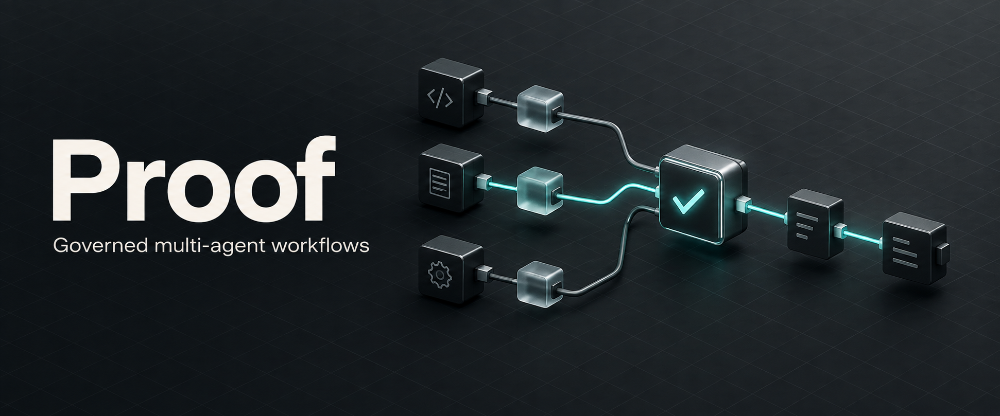

# Proof



**Give software agents a clear task, a bounded workflow, and evidence to review.**

Proof is a Claude Code plugin with **26 composable engineering skills**. It helps
teams understand a codebase, design changes, implement and test them, review
findings, and prepare releases. Shared policies govern workflow shape, model
routing, verification, and human gates.

[](LICENSE)
[](#the-skills)
[](https://github.com/santapong/Proof/actions/workflows/validate.yml)

[Quick start](#quick-start) · [Architecture](#architecture) · [Team workflow](#software-team-workflow) · [Skills](#the-skills) · [Local ML](#optional-local-ml) · [Contributing](#contributing)

_Formerly Heimdall and TheLoopSkill. Skill commands remain `loop-*`._

## Quick start

Install in Claude Code:

```text
/plugin marketplace add santapong/Proof
/plugin install proof@proof
```

Choose a concrete task:

```text
/loop-guide I inherited this repo; help me understand the payments flow
/loop-review the changes on this branch for concrete defects
/loop-engine find all flaky tests --dry-run
```

Use `loop-guide` when you need help choosing a skill. Go directly to the relevant
skill when the task is already clear. See [INSTALL.md](INSTALL.md) for local
installation and other hosts, and the [software-team guide](docs/software-team.md)
for intake, handoffs, and context advice.

## Architecture


The **authoring session** reads a skill and the references it needs, then uses
`loop-engine` to prepare a bounded workflow. The **host's Workflow tool** executes
that script. `proof-mcp` supplies authoring tools and source citations; it is
separate from the execution sandbox. Results return to a human gate.

| Part | Responsibility |
| --- | --- |
| Skills and references | Thin `SKILL.md` entrypoints; deeper guidance loaded when needed |
| Shared policies | Workflow shape, canonical `ROUTES`, lifecycle phases, and gates |
| Workflow templates | Pipelines, justified parallel barriers, and bounded discovery loops |
| `proof-mcp` | Routing explanation, boundary lookup, estimation, validation, and standards lookup |
| Repository checks | Structural validation, executable template smoke checks, routing parity, host packs, and local helper checks |

Explore the [architecture guide](docs/c4/README.md),
[detailed skill composition](docs/c4/diagrams/skill-composition.svg), or
[runtime and development views](docs/views/4plus1.md).

## Software-team workflow


Start with the task, repository state, constraints, and acceptance evidence.
Read the relevant references, run the phase, and hand back changed paths, check
results, and unresolved findings. `loop-review` reviews a diff; `loop-test`
produces tests; `loop-debug` investigates a reproducible failure. Keep those
responsibilities explicit in a handoff.

The execution dial is `--mode lite | balanced | all-out` where the selected skill
supports it. `balanced` is the default; `all-out` adds a pre-flight estimate before
execution. Exact model tiers and verification widths live in
[execution-modes.md](.claude/skills/loop-engine/references/execution-modes.md).
The autonomous improvement workflow remains **propose-only**: it drafts changes
and PRs for review.

## The skills

| Need | Start here |
| --- | --- |
| Choose a skill or understand an unfamiliar repo | `loop-guide`, `loop-comprehend` |
| Assess an idea, find prior art, or research a question | `loop-venture`, `loop-scout`, `loop-research` |
| Plan work and manage its context | `loop-orchestrate`, `loop-context` |
| Design a system, interface, or algorithm | `loop-design`, `loop-frontend`, `loop-algo` |
| Build and improve an implementation | `loop-build`, `loop-engine`, `loop-pattern` |
| Diagnose, test, review, or evaluate | `loop-debug`, `loop-test`, `loop-review`, `loop-audit`, `loop-experiment` |
| Integrate and prepare a release | `loop-integrate`, `loop-ship` |
| Operate a service or investigate an incident | `loop-operate`, `loop-incident` |
| Document and improve the workflow itself | `loop-docs`, `loop-skill`, `loop-harness`, `loop-autopilot` |

See the [skill atlas](docs/c4/skills.md) for visual groupings and
[boundary audit](docs/design/boundary-audit.json) for the separating questions
between overlapping skills. Flags are specific to each skill's entrypoint.

## Optional local ML

The source checkout includes a **local context advisor**. Its default lexical
matcher suggests candidate skills and a reading plan. An opt-in Naive Bayes
classifier can add learned suggestions; both paths use Node's standard library
and make no provider calls.

```sh
# Default: no training or model file required.
node scripts/software-context.mjs rank --task "Review this branch for defects"

# Experimental: train locally, then request learned suggestions.
node scripts/software-context.mjs train --data docs/examples/software-routing-train.jsonl --out /tmp/proof-routing.json
node scripts/software-context.mjs rank --task "Review this branch for defects" --model /tmp/proof-routing.json
```

Choose a fresh output path for each training run. The classifier cannot change
permissions, verification gates, or execution-model choices. On the published
40-request synthetic routing set, its first candidate was correct on **23/40**,
versus **29/40** for lexical matching. It remains experimental; actual token and
cost savings are unmeasured. [Training guide](docs/software-team.md) ·
[Evaluation and limitations](docs/examples/software-efficiency-evaluation-final.md).

## Other hosts

Generated packs carry **22 of the 26 skills** to **Cursor, OpenAI Codex, and
Antigravity**. They preserve portable guidance and references while excluding
Claude-specific workflow scripts and four native skills. This is a packaging
boundary, not a claim of equivalent multi-agent execution in every host.

[Install a host pack](INSTALL.md) ·
[Packaging design](docs/design/ADR-0008-host-packaging-seam.md) · [Host status](ROADMAP.md).

## Contributing

Ordinary work branches from and targets **`develop`**; **`main`** carries releases.
Use a focused `feat/*`, `fix/*`, `docs/*`, or other documented branch and remove it
after verified integration. See the [branch policy](docs/branch-policy.md).

[Contributing and checks](CONTRIBUTING.md) · [Changelog](CHANGELOG.md) ·
[Architecture sources](docs/c4/README.md#diagram-sources-and-rendering).

## License

[MIT](LICENSE) © santapong
