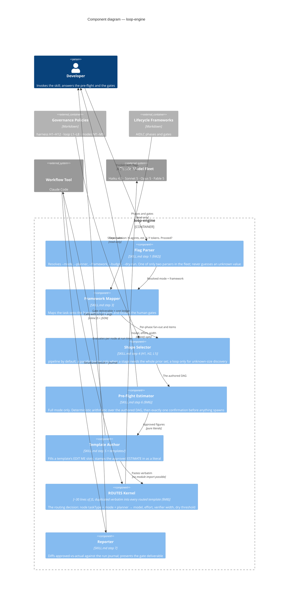

# C4 Component (Level 3) — inside `loop-engine`

C4 says stop at Level 2 unless a container's internals are genuinely non-obvious. One container here qualifies: **`loop-engine`**, the orchestration engine every other skill authors through. Its internals are non-obvious for a specific reason — the work is split across **two execution contexts with incompatible capabilities**, and almost every design constraint in this plugin falls out of that split.

- **Authoring context** (the agent session): can read files, search the web, ask the human a question, and reason. Cannot run a workflow.
- **Execution context** (the Workflow sandbox): can spawn agents in parallel. **Cannot** read the filesystem, import a module, read a clock, or prompt anybody.

Anything interactive or estimated must therefore happen at authoring time and enter the script **only as pure literals**. That single sentence explains the pre-flight's placement, the `ESTIMATE` literal, and the duplication rule below.

## The mechanism, component by component

**Flag Parser (§M2).** Only two files in the whole plugin parse flags — this one and `loop-orchestrate`. Fourteen domain skills advertise `--mode` and forward their *raw argument string*; that pass-through is the entire inheritance mechanism, which is why no domain skill contains mode logic. Two skills (`loop-design`, `loop-harness`) advertise nothing, because they ship no template and route nothing: a skill that cannot honour a flag must not advertise it.

**Shape Selector (H1/H2/L1).** Three shapes, and the discipline is in refusing the wrong one. `pipeline()` is the default — item A can be in stage 3 while item B is still in stage 1, so wall-clock is the slowest *chain*, not the sum of slowest-per-stage. A `parallel()` **barrier** is allowed only when a stage genuinely needs the whole prior set: a cross-item dedup, a zero-count early exit, or a prompt that compares findings against each other. "I need to flatten first" is not a barrier. A **loop** is only for unknown-size discovery; a known work-list is a pipeline, never a loop.

**Pre-flight Estimator (§M6).** Fires once, only under `--mode full`, in the session, after the script is authored and before the Workflow tool is called — so nothing has spawned when the human answers. The arithmetic is `agents = Σ items(n) × width(n)` and `tokens(n) = agents(n) × BAND[kind][mode] × SIZE[n.size]`, evaluated twice: once at `full` for the headline and once at `optimize` for the delta. Every input is a literal already in the script. **No sampling, no clock, no RNG** — same DAG, same numbers, every time, which is exactly what makes an approved estimate diffable against actual spend.

**ROUTES Kernel (§M8) — and why it is copy-pasted.** This is the component that most looks like a mistake and is not. The block appears **byte-identically in all 19 routed templates**. It cannot be factored into a shared import because the execution sandbox has no module system and no filesystem — an `import` is not available to be written. So duplication is the only expressible form, and the design makes it a *rule* rather than an apology: this file is the single source of truth, drift is a defect, and `scripts/validate.mjs` extracts the canonical block from `execution-modes.md` at run time and diffs every copy against it. Change the block, and it changes in all nineteen in the same commit.

**Reporter.** Reads `<transcriptDir>/journal.jsonl`, which records each agent's actual return value, and diffs it against the `ESTIMATE` literal the pre-flight stamped in. Full mode's justification is that the human approved a priced bill; the reporter is what makes the bill checkable afterwards.

## The two-context split, restated as constraints

| Constraint | Falls out of |
|---|---|
| `export const meta` is a **pure literal** — no variables, calls, or interpolation | The host reads it before executing the script |
| No `Date.now()`, no `Math.random()`, no argless `new Date()` | Resume must replay deterministically from cache |
| `args` normalized with `typeof args === 'string' ? JSON.parse(args) : args` | Some harnesses deliver args as a string |
| `.filter(Boolean)` on every `parallel()` result | A dead or skipped agent resolves to `null`, never rejects |
| A `schema` on every consumed `agent()` call | Validation happens at the tool-call layer, so the model retries instead of the script parsing prose |
| The pre-flight lives in the session, not the script | A script cannot prompt a human |
| `ROUTES` is duplicated, not imported | The sandbox has no module access |

Each of these is a hard rule in `harness-policy.md` (H10) and each is checked by the validation gate.

---

**Previous:** [Container (Level 2)](container.md) · **Next:** [mechanism, ideas and references](README.md)
