# C4 Container (Level 2) — Heimdall

**What are the separately-loadable units inside the plugin, what is each one made of, and how do they talk?**

A C4 container is a *runtime or deploy boundary*, not a Docker container. For a plugin with no server, the meaningful boundary is **what gets loaded, when, and by whom** — and that is genuinely different per unit. A `SKILL.md` enters the agent's context the moment a skill is invoked; a `references/*.md` file is read only if that skill's router decides it is needed; a `*.workflow.js` is never read by the agent at all — it is *executed* by the Workflow tool in a sandbox with no filesystem. Those are three different loading regimes, so they are three containers.

Diagram source: [`diagrams/src/container.mmd`](diagrams/src/container.mmd) · regenerate with `node scripts/render-diagrams.mjs`

## The containers, and why each is its own unit

| Container | Loading regime | Why it is separate |
|---|---|---|
| **Skill Routers** | Into agent context, on invocation | The `description` field is API: it is the *only* thing the model sees when choosing a skill. Routers stay thin so twenty-four of them can coexist without drowning the context window. |
| **Reference Library** | On demand, by the router's flow | Progressive disclosure. 93 files of standards-grade depth would never fit in context at once; the router decides which two or three matter for this task. |
| **Workflow Templates** | Executed, never read into context | A different execution model entirely — plain JS in a sandbox with no filesystem, no clock, and no module access. That sandbox is what forces the `ROUTES` duplication rule (see [Component](component.md)). |
| **Governance Policies** | Read-only, before authoring | Consumed by every skill and modified by none. Separating them is what lets twenty-four skills share one orchestration discipline instead of twenty-four dialects. |
| **Lifecycle Frameworks** | Read-only, selected by flag | Pluggable: `--framework <name>` resolves to a file. AIDLC is the default, not the only option. |
| **Design Records** | Review-time, by humans and reviewers | Normative and machine-readable. Kept because three of its mandates were once dropped from a build plan and, since every review checked the plan instead, nobody noticed. |
| **Validation Gate** | CI, on push and PR | The only container that *executes in the repo's own CI*. It exists because the host's `plugin validate` reads the marketplace manifest and never opens a `SKILL.md`. |
| **Plugin Manifests** | By the host, at install | The discovery contract. Skills under `.claude/skills/` are auto-discovered, so this rarely changes. |

## The three flows worth tracing

**Selection.** `Developer → Claude Code → Skill Routers`. The host matches the request against twenty-four `description` fields. Nothing else is loaded yet, and nothing else influences the choice — which is why the [boundary audit](../design/boundary-audit.json) treats those fields as the product's real API surface.

**Authoring.** `Router → Policies + Framework + References → Template`. The skill reads its law, maps the task onto phases, and fills a template's `EDIT ME` slots. This all happens *in the agent's context*, at authoring time, which is what makes it possible for an interactive pre-flight to exist at all — a script cannot prompt a human, but the session can.

**Execution.** `Claude Code → Template → Model Fleet → Repository`. The Workflow tool runs the script; the script's `ROUTES` block decides each node's model and effort; agents read the repository and, in an `implement` node, write to it. The developer sees a phase gate at the end, not a merge.

## Boundaries this diagram asserts

- **Templates never call the fleet directly on their own authority** — every `agent()` call takes its `model` and `effort` from `ROUTES`, so routing policy cannot be quietly overridden per template. The gate enforces this by rejecting a bare `model:` literal outside the block.
- **Only the fleet touches the repository.** No container here writes code; agents do, inside a phase a human approved.
- **The gate points at routers and templates, not at references.** Reference *content* is not mechanically checkable — a stale version pin looks exactly like a fresh one to a parser. That gap is real, and it is why standards accuracy is a review discipline with a confirmation log rather than a CI check.

---

**Previous:** [Context (Level 1)](context.md) · **Next:** [Component (Level 3)](component.md) → [mechanism, ideas and references](README.md)
