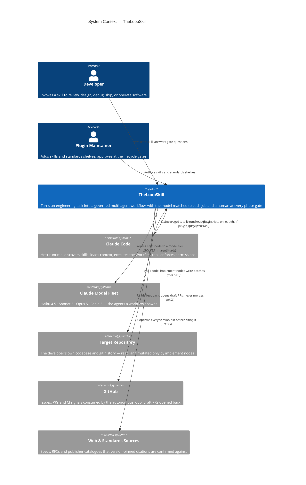

# C4 System Context (Level 1) — TheLoopSkill

**What is this system, who uses it, and what does it depend on?**

TheLoopSkill is a **Claude Code plugin**: nineteen composable engineering skills built on a multi-agent workflow engine. It ships no server and no runtime of its own — it is Markdown and JavaScript that the Claude Code host loads, reads, and executes on the developer's behalf. That is the single most important thing this diagram communicates, and it is why Claude Code appears *outside* the box rather than inside it.

## Reading it back, one sentence per arrow

- The **developer** invokes a skill and answers the questions the lifecycle gates raise.
- **Claude Code** discovers the plugin, loads the skill into context, and executes the workflow scripts the skill authors — TheLoopSkill never runs anything itself.
- The system **routes each node** of that workflow to a model tier, so a mechanical enumeration and an adversarial security verdict do not cost the same.
- It **reads the target repository** freely; only `implement` nodes write, and only within the phase a human approved.
- It **reads GitHub feedback and opens draft PRs** — the autonomous loop proposes and never merges.
- It **confirms version pins against primary sources** before a standards shelf asserts one.

## Why the boundary sits here

Three placements are deliberate and worth defending, because getting them wrong is the usual way a Context diagram misleads:

**Claude Code is external, not internal.** The plugin has no process, no port, and no lifecycle of its own. Everything it "does" is done by the host: skill discovery reads the `plugin.json` manifest, the agent loop loads `SKILL.md` into context, and the Workflow tool is what actually spawns subagents. Drawing Claude Code inside the box would claim ownership of machinery the plugin only *instructs*.

**The model fleet is external and singular.** Four models appear as one box because from the outside they are one dependency with one failure mode — an unavailable or rate-limited fleet. Which tier a given node gets is a Level 2 concern (the `ROUTES` block), not a Level 1 one.

**The target repository is external.** The plugin is installed once and pointed at many codebases. The repository is the *subject* of the work, not part of the system doing it — which is also why a mutation boundary (only `implement` nodes write) is worth stating on the arrow.

## What is deliberately absent

No skills, no policies, no templates, no `ROUTES` block, no phases. Nineteen skills drawn as nineteen peer boxes would be the classic Level-1 mistake: from the outside, this is one plugin with one entry point per task. Open the box at [Level 2 — Container](container.md).

---

**Next:** [Container (Level 2)](container.md) → [Component (Level 3)](component.md) → [mechanism, ideas and references](README.md)
