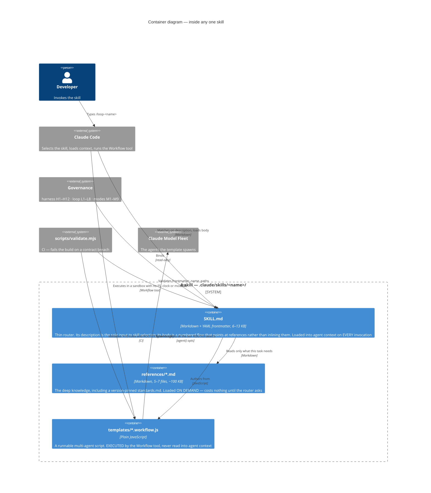
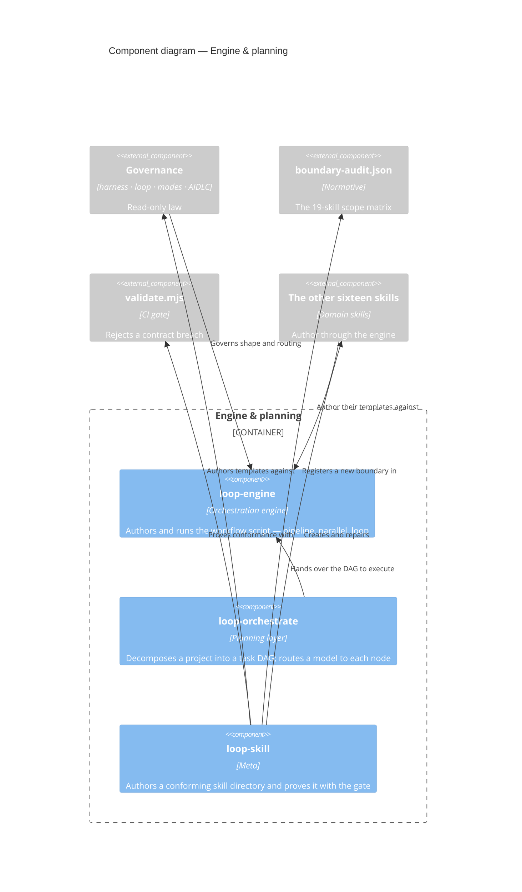
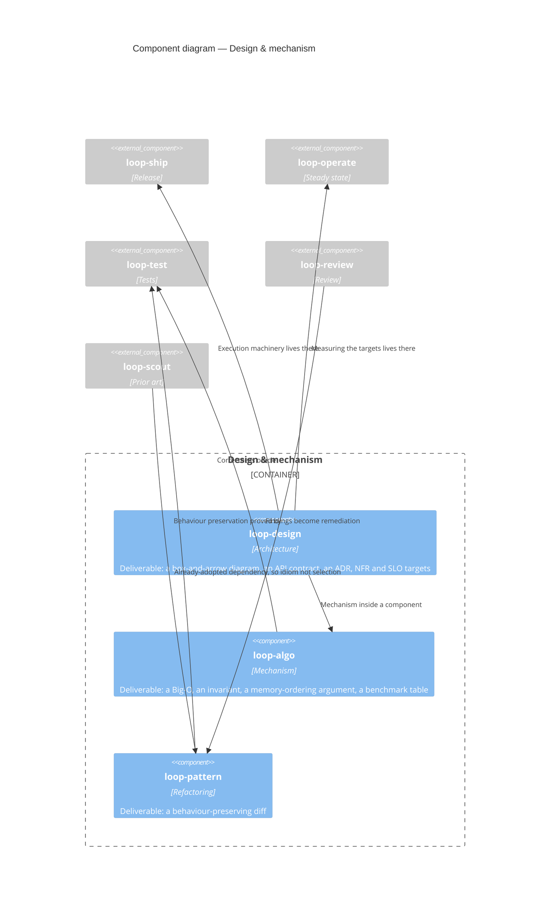
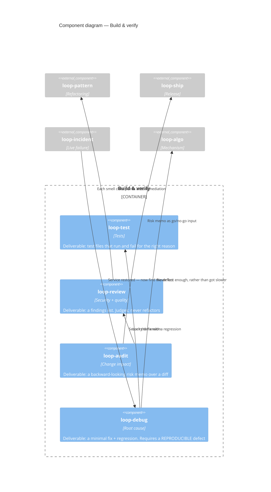
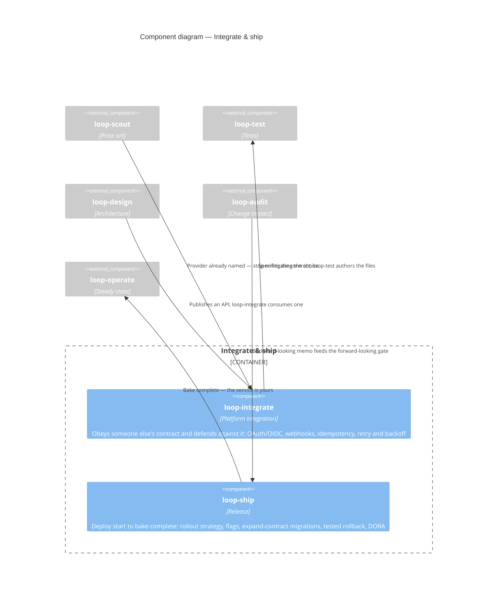
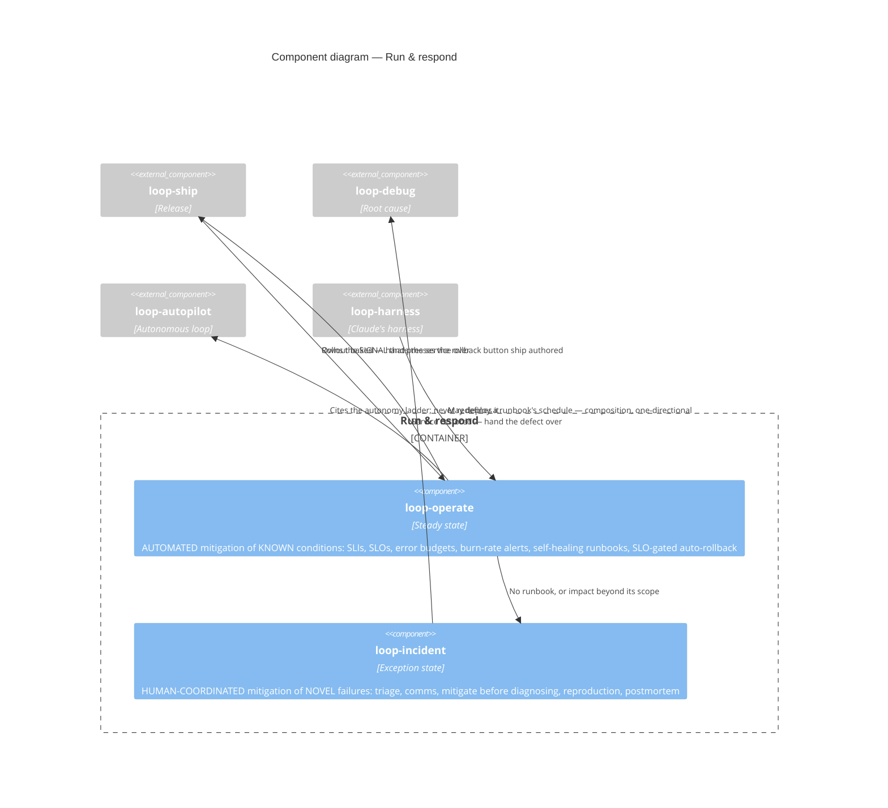
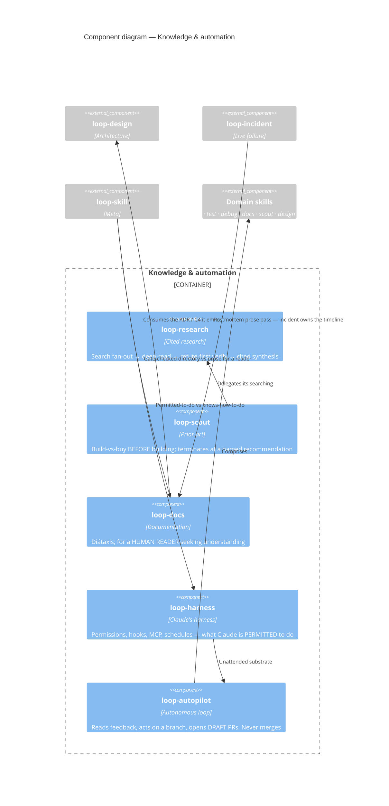

# C4 — the skill fleet

Nineteen skills, drawn at two altitudes.

**One diagram per skill would be nineteen copies of the same picture.** Every skill has an identical internal structure — router, references, template — which is drawn once below as the *skill container view* and explained in [`skill-anatomy.md`](skill-anatomy.md). What actually differs between skills is their **relationships**: who delegates to whom, and where each one stops. So the per-skill views are grouped by role, and each shows the edges that make its members distinct.

---

## The skill container view — true for all nineteen

Zoom into any single skill and this is what you find. The three parts are separate **because they load differently**, which is the constraint the whole design turns on.

The asymmetry is the point: **the router is charged on every invocation, the references are charged only when read, and the template is never charged at all** — it runs somewhere the agent's context does not reach.

---

## Engine & planning

The base layer. Everything else authors through `loop-engine`; `loop-skill` authors the skills themselves.

**Where each stops.** `loop-orchestrate` plans and never runs; `loop-engine` runs one task now. `loop-skill` changes what Claude *knows how to do* — `loop-harness` changes what it is *permitted* to do.

---

## Design & mechanism

Three altitudes on "how should this be built", separated by the shape of the deliverable.

**The tests.** Boxes and contracts → `loop-design`. A complexity bound or an invariant → `loop-algo`. A diff whose test suite passes unchanged before and after → `loop-pattern`. *Shard the queue across N nodes* is design; *which lock-free queue and what are its progress guarantees* is mechanism.

---

## Build & verify

Everything that inspects or proves code. The split is the **artifact each produces**.

**The tests.** Findings list or diff? → review vs pattern. Backward over a diff, or forward over a rollout? → audit vs ship. Can you paste a stack trace? → debug. Is the service *down*? → incident, not debug.

---

## Integrate & ship

Both face outward — one at someone else's API, one at production.

**The tests.** Does answering add a line to the dependency manifest? → `loop-scout` first, then `loop-integrate`. Does this system *publish* the API or *consume* it? → design vs integrate. Idempotency appears in both, as different obligations: design requires callers to send a key, integrate requires this system to send one.

---

## Run & respond

The thinnest boundary in the fleet, held apart by one checkable predicate.

**The predicate, stated as the first sentence of both bodies:** *does a runbook exist for this condition, **and** does executing it restore the SLI?* Yes → `loop-operate`, no declaration. No, or the impact exceeds the runbook's scope, or a human must be paged → `loop-incident`. Only `loop-incident` writes postmortems.

This pair ships **on probation**: a review tripwire fires if either skill's body spends more than ~30% of its length restating the other's phase, on the grounds that one honest skill beats two fighting for the same trigger.

---

## Knowledge & automation

Cross-cutting support, plus the loop that composes everything.

**The tests.** A runbook is markdown but its steps are *executed*, possibly unattended — that is `loop-operate`, not `loop-docs`. A postmortem belongs to `loop-incident`, which owns the timeline data. `loop-research` gathers evidence for any question; `loop-scout` answers one specific question — should we build this — and delegates its searching here.

---

**See also:** [Context (L1)](context.md) · [Container (L2)](container.md) · [Component (L3)](component.md) · [skill anatomy](skill-anatomy.md) · [the normative boundary matrix](../design/boundary-audit.json)
