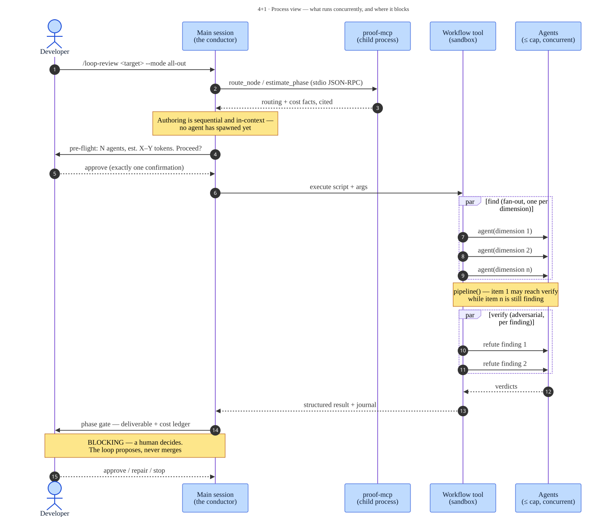

# The 4+1 views — Proof

C4 answers *what is this made of*, one altitude at a time. It is a **structural** model, and it is
deliberately bad at three questions this system keeps raising: what runs at the same time and where
it blocks, what a contributor edits and what gate catches them, and what process actually executes
on whose machine.

Those are the questions Kruchten's **4+1 view model** (1995) was built for. Four views, each for a
different reader, plus a fifth that ties them together by walking real scenarios through all four:

| View | Answers | Reader | Its blind spot |
|---|---|---|---|
| **[Logical](#1--logical-view)** | What are the functional parts, and how do they depend on each other? | Anyone reasoning about behaviour | Says nothing about time or machines |
| **[Process](#2--process-view)** | What runs concurrently, what serialises, where does it block? | Anyone debugging a slow or stuck run | Says nothing about files |
| **[Development](#3--development-view)** | What does a contributor edit, and what gate catches a mistake? | Contributors | Says nothing about runtime |
| **[Physical](#4--physical-view)** | What process runs where, and what crosses a network? | Anyone installing or operating it | Says nothing about *why* |
| **[+1 Scenarios](#1--scenarios)** | Do the other four actually agree with each other? | Reviewers of this document | It is the test, not the design |

**How this relates to the [C4 docs](../c4/README.md).** They overlap on purpose and disagree
nowhere. C4's Context and Container levels *are* a coarse logical + physical view; the 4+1 set adds
the process and development views C4 has no level for, and forces the scenario walk that catches
drift between them. Where both describe the same thing, C4 is the more detailed one and wins:

| 4+1 view | Nearest C4 artifact | What 4+1 adds |
|---|---|---|
| Logical | [Container](../c4/container.md), [the skill fleet](../c4/skills.md) | Groups the 26 skills by *role* rather than by loading regime |
| Process | [Component](../c4/component.md) — partly | Concurrency, barriers, and the blocking human gate |
| Development | — *(no C4 level)* | The repo's module structure and the repository gates |
| Physical | [Context](../c4/context.md) — partly | Processes, machine boundaries, what is a network hop |
| Scenarios | The [task walkthrough](../c4/README.md#follow-a-task) | Four paths, not one, including the failure ones |

Diagram sources live with the C4 ones in [`../c4/diagrams/src/`](../c4/diagrams/src/) — one render
pipeline for the whole repo (`node scripts/render-diagrams.mjs`). Edit the `.mmd`, never the `.svg`.

---

## 1 · Logical view

**What the system is made of, functionally — and what constrains what.**

Four layers, and the arrows between them are the whole architecture in one sentence: **governance
constrains the engine, the engine executes the domain skills, the domain skills hand back at every
gate, and autonomy composes the lot on a schedule.**

- **Governance** — `harness-policy` (H1–H12), `loop-policy` (L1–L8), `execution-modes` (M1–M9) and
  three lifecycle frameworks. Read by every skill, modified by none. This layer is why 26 skills
  share one orchestration discipline.
- **Engine & planning (7)** — `loop-engine` runs one workflow; `loop-orchestrate` plans a project
  into a DAG before it; `loop-context` decides what agents carry between phases; `loop-build`
  conducts a whole v1; `loop-skill` authors new members of the fleet; `loop-guide`
  routes intake; `loop-venture` assesses a product idea.
- **Domain skills (18)** — grouped by lifecycle role, not by technology. Each owns one
  mutually-exclusive scope line in the [boundary audit](../design/boundary-audit.json), which is
  normative for resolving scope. The group includes `loop-experiment` for controlled evaluations.
- **Autonomy (1)** — `loop-autopilot` is the only skill that composes others unattended, and it is
  propose-only by construction.

**What this view is not for.** It shows no timing, no machine, and no file. A skill "depending on"
governance here means *reads it before authoring*, not *calls it at runtime*.

---

## 2 · Process view

**What runs at the same time, and where a human stops it.**

The important part of this diagram is what is *not* parallel:

- **Authoring is sequential and in-context.** Flag parsing, framework mapping, shape selection and
  the pre-flight estimate all happen in the main session before any agent exists. This is what makes
  an interactive pre-flight possible at all — a sandboxed script cannot prompt a human, but the
  session can.
- **Fan-out is capped and pipelined.** `pipeline()` is the default: item 1 can be in verify while
  item *n* is still in find. A barrier (`parallel()`) is a cost that must be *earned* by a genuine
  cross-item dependency — that is loop-policy L1, and it exists because the naive shape idles fast
  workers behind the slowest one.
- **The gate blocks, and it blocks on a person.** The arrow that matters most in this system is the
  one where a human answers. Everything upstream is a proposal.
- **`proof-mcp` is a separate process** with its own lifecycle — spawned by the host over stdio,
  answering from the same source documents the skills read. Source citations let a reviewer
  check each answer against the current contract.

---

## 3 · Development view

**What a contributor edits, and which gate catches them when it is wrong.**

One rule dominates: **`.claude/skills/` is the only place a skill is edited.** Everything else in
the output column is generated — the plugin manifest points at the source, `dist/<host>/` is packed
from it, the detailed C4 `.svg`s are rendered from `.mmd`. The new overview and native workflow SVG have their own [documented asset sources](../assets/README.md).

Core gates catch different classes of failure:

| Gate | Catches | Blind to |
|---|---|---|
| `validate.mjs` | Invalid frontmatter, `name`/directory mismatch, dangling reference paths, `ROUTES` drift against §M8 | Whether a template *runs* |
| `smoke.mjs` | A template that parses but routes wrong — mode-inert nodes, a planner flag that reaches nothing | Anything outside `*.workflow.js` |
| `check-host-packs.mjs` | Non-deterministic packing, a held-back skill leaking, a pointer that dangles once four skills are removed | Anything Claude Code-only |

The full suite also checks routing-block extraction parity, the local context advisor, and branch policy; see [CONTRIBUTING.md](../../CONTRIBUTING.md).

The host-pack gate catches an additional boundary: a cross-reference that is perfectly valid in
`.claude/skills/` can be **broken in a pack**, because [ADR-0008](../design/ADR-0008-host-packaging-seam.md)
holds four skills back. Green locally, red in CI, and the fix is a `carryFiles` entry rather than an
edit to generated output.

---

## 4 · Physical view

**What process runs where, and what crosses a network.**

- **Almost everything is local.** Claude Code runs the Workflow sandbox in-process; `proof-mcp`
  is a child process on the same machine, speaking stdio, dying with the session. The MCP server
  uses stdio and requires no listening port.
- **Model requests leave the machine.** Repository hosting, research tools, and target-system
  integrations can add network traffic according to the task; the diagram is not a network allowlist.
- **CI is the second machine**: an ephemeral ubuntu runner with Node 22 that re-runs the repository
  gates on every push and PR to `main`/`develop`.
- **The dashed box is honest.** Another developer's machine running Cursor, Codex or Antigravity is
  a *target*, not a deployment: packs are generated here, copied by hand, and no pack has yet been
  installed into a real session of any of the three ([ROADMAP](../../ROADMAP.md) H1/H3/H4). Note
  what that host still has to do — spawn its *own* `node server.mjs`, at an absolute path resolved
  when the pack was built.

---

## +1 · Scenarios

**Four paths through the other four views. If a view contradicts a scenario, the view is wrong.**

- **S1 · Review a diff** — the everyday path, and the one the whole design is shaped around:
  select → disclose progressively → fan out → refute → gate.
- **S2 · Add a skill** — the contributor path, ending deliberately on a *failure*: a new pointer
  into a held-back skill passes locally and fails in CI. A scenario that only shows the happy path
  is decoration.
- **S3 · Run unattended** — the autonomy path. The only one that starts without a human, and it
  still ends at one.
- **S4 · Install on another host** — the portability path, drawn dashed because it is unproven:
  22 of 26 skills are packaged. Installed skill routing and MCP behavior need verification in
  each target host; the generated notes describe the missing workflow runtime.

---

**See also:** [C4 architecture docs](../c4/README.md) · [design records and ADRs](../design/README.md) · [ROADMAP](../../ROADMAP.md)
